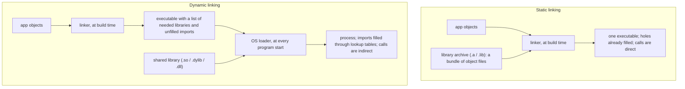
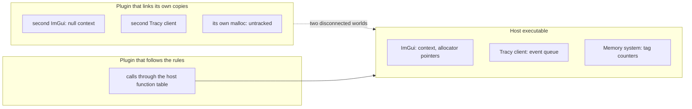

# eZeGo — Linking Model: Static vs Dynamic

> **Status:** Proposal, 2026-10-04. Decisions are *proposed* until confirmed. Decision IDs (`L-n`) are indexed in [`README.md`](./README.md).
> **Companions:** [`build-system.md`](./build-system.md) · [`observability.md`](./observability.md) · [`plugins.md`](./plugins.md) · [`philosophy.md`](./philosophy.md)
> **Resolves:** the "vendor static vs dynamic" open item in `philosophy.md` §6, `application-architecture.md` §5 and `plugins.md` §7.

---

## 1. The decision in short

| ID | Decision |
|---|---|
| **L-1** | Everything we compile from source, first-party modules and all vendored libraries, is linked **statically into one executable**, in every build mode. |
| **L-2** | Only true system boundaries stay dynamic: the OS, the GPU driver, the windowing system, the audio server. |
| **L-3** | Language runtimes: static C runtime on Windows; static C++ runtime on Linux for release builds, with the C library dynamic; the system runtime on macOS. |
| **L-4** | Plugins are the only first-class dynamic code, and they are isolated: the host exports no symbols, and plugins see the host only through function tables. |
| **L-5** | Libraries with global state (allocator, profiler, logger, UI context) exist **exactly once per process**, inside the host. |
| **L-6** | No registration through static initializers. Modules register explicitly. |

Bundle size is not a concern for this project, which removes the main argument for dynamic linking. What remains favours static on performance, on profiling, and above all on predictability at runtime.

---

## 2. What the two words mean

### 2.1 From source to running process

1. **Compile.** Each `.cpp` becomes an *object file*: machine code, a table of the symbols it defines, and a list of "holes" where the address of something defined elsewhere must be filled in.
2. **Link.** The holes get filled. *When* and *by whom* is the whole difference between static and dynamic.

- A **static library** is an archive of object files. The linker copies the objects it needs into the executable and fills every hole at build time. At runtime there is no library any more, only one program.
- A **shared (dynamic) library** is a separately linked binary with a table of exported symbols. The executable records "I need `foo` from `libbar`". At every start the OS loader finds the file, maps it into memory and fills a lookup table. Calls across the boundary jump through that table.

### 2.2 What the dynamic boundary costs

| Cost | Size | Notes |
|---|---|---|
| The call is indirect | Small: a few CPU cycles per call | Matters only for very small, very hot functions |
| **The optimizer cannot see across it** | The significant one | No inlining, no constant propagation, no link-time optimization across the boundary. Same reasoning as the rule against virtual calls in hot loops (philosophy §2.2). |
| Resolution moves to the user's machine | A reliability cost, not a speed cost | A missing or mismatched library is a failure at program start, in front of the user, instead of a build error in front of us |
| Slower thread-local storage inside shared libraries (mainly Linux) | Small per access | Matters for allocator and profiler internals, which use thread-local state on every call |
| Global state is per binary | A correctness trap | Two binaries that each contain a copy of a library have two separate copies of its globals (§6) |

### 2.3 What dynamic linking buys

| Benefit | Relevant to eZeGo? |
|---|---|
| Several programs share one copy; the OS can update the library without rebuilding the apps | No. Our vendored libraries are not shared with anything. |
| Smaller downloads | No. Explicitly not a concern. |
| Code can be loaded and unloaded at runtime | **Yes, for plugins.** That is what the plugin system is. |
| Faster incremental links in very large codebases | Not at our size (§7) |
| Using a vendor SDK that ships only as a binary | Possibly later; handled through plugins (§7) |
| Licence separation for LGPL libraries | Not today; all current dependencies are permissively licensed |

---

## 3. Trade-offs weighed for eZeGo

| Dimension | Static | Dynamic | Weight for us |
|---|---|---|---|
| Runtime speed | Direct calls; inlining and link-time optimization possible across library boundaries | Indirect calls; each library is an optimization island | Medium. The frame is not dominated by cross-library calls, but static is never slower. |
| Predictability | The binary we tested is the binary that runs | Behaviour depends on which library files are found at start | **High.** This tool runs live shows. |
| Profiling | One image, one symbol file; every sample resolves | Works, but symbols must be present per library | Medium |
| Memory instrumentation | One allocator world. Replacing `operator new` in the executable covers all statically linked C++ code on all three OSes | On Windows each DLL binds to its own runtime, so a replacement in the executable does not reach it | **High** for the profile build ([`observability.md`](./observability.md) §4) |
| Startup | Nothing to resolve for our own code | Loader work per library | Low |
| Distribution | One file plus assets | Search paths, install names, redistributables | High |
| Incremental link time | The whole executable relinks on every change | Only the changed library relinks | Low at our size, with a fast linker |
| Hot reload | Not possible for static code | Possible | Medium; delivered through plugins instead (§7) |
| Patching a library after release | Requires a new release | Can swap a file | Low; we control releases |

---

## 4. What stays dynamic no matter what

"Fully static" is not available on any of the three platforms, and should not be wanted.

| | Linux | macOS | Windows |
|---|---|---|---|
| C library | glibc, **dynamic**. Statically linked glibc breaks name resolution and `dlopen`, and plugins need the dynamic loader. | libSystem, dynamic. Apple does not support static executables. | UCRT is part of Windows 10 and 11 |
| C++ runtime | Our choice (L-3) | libc++, part of the OS | Our choice (L-3) |
| GPU | Vendor driver through the system's GL dispatch library | System OpenGL framework | Vendor driver through `opengl32` |
| Windowing | X11 / Wayland client libraries, which GLFW loads at runtime | Cocoa frameworks | Win32 system DLLs |
| Audio | ALSA / PulseAudio / PipeWire / JACK client libraries | CoreAudio, CoreMIDI | WASAPI, WinMM |

These are stable OS interfaces that must match the user's machine: a GPU driver compiled into the app would be wrong on every machine but one. Requiring their development packages at build time is `doctor`'s job ([`build-system.md`](./build-system.md) B-6).

---

## 5. Language-runtime decisions (L-3)

### Windows: static C runtime (`/MT`)

| | `/MD` (dynamic runtime) | `/MT` (static runtime) |
|---|---|---|
| End-user requirement | The Visual C++ Redistributable must be installed, or its DLLs shipped beside the app | None |
| Runtime state (heap bookkeeping, `errno`, open files) | Shared by every module in the process | One private copy per module (executable and each plugin DLL) |
| Usual advice | Preferred when app and DLLs pass runtime-owned objects to each other | Safe only if nothing runtime-owned crosses module boundaries |

**Decision: `/MT`.** The plugin ABI already forbids everything that makes `/MT` dangerous: the host provides the allocator, no `std::` types cross, no exceptions cross ([`plugins.md`](./plugins.md) §2). In exchange the "VCRUNTIME140.dll was not found" class of support problem disappears.

**Cost.** A runtime security fix reaches users only through a new eZeGo release. Every static library in the link must use the same runtime flavour, which holds automatically because we build everything from source in one tree.

### Linux: static C++ runtime in release, dynamic glibc

Release builds link `libstdc++` and `libgcc` statically. The executable then depends only on glibc and the system driver libraries, which removes the common "`GLIBCXX_3.4.xx` not found" failure across distributions. The remaining floor is the glibc version of the machine that produces release builds, so releases must be built on the oldest distribution we support. That choice is deferred to packaging time.

A plugin written in C++ will load its own copy of the C++ runtime. Two C++ runtimes in one process is safe **only because** no C++ object or exception crosses the plugin boundary. The pure C ABI is what makes this decision possible.

### macOS: nothing to decide

libc++ is part of the OS and is always dynamic. The deployment target sets the minimum macOS version.

---

## 6. Plugins and a static host (L-4, L-5)

Plugins are shared libraries by nature. The risk with a static host is not the plugin being dynamic. It is **duplication of state**:

A plugin that statically links its own ImGui gets a second, empty ImGui. Its own Tracy client is a second profiler that fights the first. Its own allocator is invisible to the memory system.

**Rules.**

1. **The host exports nothing.** It is built with hidden symbol visibility and without exporting its dynamic symbol table. A plugin cannot bind to host internals by symbol name, even accidentally.
2. **Everything the host offers arrives through the `ez_host_api` function table** passed at registration, as [`plugins.md`](./plugins.md) §6 already sketches. Plugins link against nothing from the host: no import library on Windows, no special linker flags elsewhere.
3. **Plugins are loaded with local symbol scope**, and the SDK's build helper compiles them with hidden visibility. A plugin's private dependencies then cannot collide with the host's or with another plugin's. Windows and macOS isolate modules this way by default; on Linux it must be requested, so the loader and the SDK do it.
4. **Stateful services live only in the host.** Memory, logging, profiling zones and UI drawing are reached through function tables. In `profile` builds the profiling entries forward to Tracy's C API; in other builds they are no-ops.
5. **Different runtimes on each side are fine**, because of the pure C ABI.

**The plugin UI surface.** A plugin cannot call Dear ImGui directly. The options were a curated C API owned by eZeGo, or Dear ImGui exposed through a C function table; the second is quick but ties every plugin to the host's exact ImGui version. **Proposed 2026-10-05: the curated API** — plugins get the C function table of eZeGo's own UI system, see [`ui-system.md`](./ui-system.md).

---

## 7. Consequences inside our own code, and when to revisit

**L-6: explicit registration.** A linker pulls an object file out of a static library only if something references it. A file whose only purpose is a global constructor that registers something (a node type, a command) is referenced by nobody and is dropped without any warning. So modules expose an explicit `register_*()` function, called from one visible place. This also removes any dependence on static-initialization order and keeps startup deterministic.

**One flag set.** Because every library is compiled in our tree with our flags, settings that must agree across a link (runtime flavour, configuration headers such as ImGui's) agree by construction.

**When we would revisit.**

| Trigger | Response |
|---|---|
| Incremental link time exceeds its budget ([`build-system.md`](./build-system.md) B-10) | A developer-only "component build": internal modules become shared libraries in `debug`, static in `release`. Unreal (modular vs monolithic) and Chromium do this. Needs export annotations, so not before it is measured as necessary. |
| We want hot reload for first-party UI or effects | Build those features against the plugin SDK and load them dynamically in development. The core stays static. |
| A vendor SDK ships only as a DLL or dylib (some DMX interfaces, video-sharing or network-video SDKs) | Never linked into the core. It lives in a plugin or device pack and is loaded on demand; eZeGo must start without it. |
| A dependency is LGPL | Link it dynamically or avoid it. `dependencies.json` records the licence so this is caught on admission. |
| A game engine should embed eZeGo's runtime | The headless core is already a set of libraries. Packaging it as a shared library with a C API for an engine-side plugin is additive and follows the same C-ABI discipline. |

---

## 8. Open questions

- **Link-time optimization.** Static linking makes it possible; whether it is worth its link time is a measurement, per philosophy §3.
- **Standard library on Linux.** libstdc++ is the default. Using libc++ would match macOS but adds a toolchain requirement. Lean: stay with libstdc++.
- **Minimum glibc** for Linux releases: decided when packaging starts.
