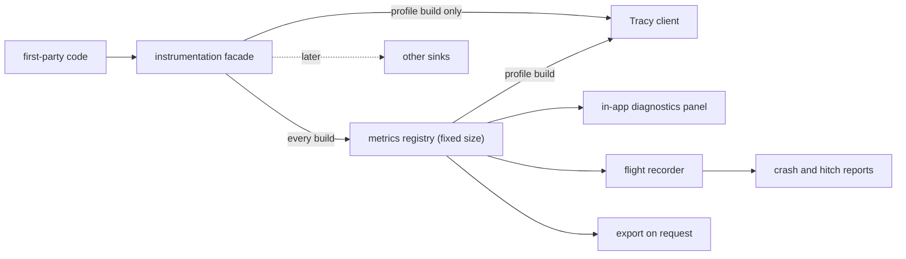
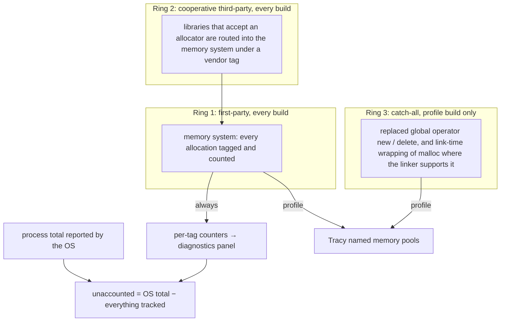

# eZeGo — Observability: Profiling and Always-on Telemetry

> **Status:** Proposal, 2026-10-04. Decisions are *proposed* until confirmed. Decision IDs (`O-n`) are indexed in [`README.md`](./README.md).
> **Companions:** [`philosophy.md`](./philosophy.md) §3 · [`build-system.md`](./build-system.md) B-3 · [`linking.md`](./linking.md) · [`threading-and-timing.md`](./threading-and-timing.md)
> **Scope:** how eZeGo measures itself: in a dedicated profiling build, and in the build users run. Names of macros and metrics are tentative.

---

## 1. Two jobs, two mechanisms (O-1)

"Profile everything" and "collect metrics in the shipped app with minimal overhead" are different jobs. Solving both with one tool makes the first too shallow or the second too expensive.

| | Deep profiling | Always-on telemetry |
|---|---|---|
| Question it answers | *Why* is this slow, and where exactly? | Is it healthy right now? What happened just before the hitch or crash? |
| Shape of the data | A stream of events: every zone, every allocation | Fixed-size aggregates: counters, gauges, histograms |
| Granularity | Function and scope | System and subsystem |
| Cost | Nanoseconds per event, unbounded data volume | Bounded: a fixed budget per frame, fixed memory |
| Needs | A developer with the Tracy GUI attached | Nothing |
| Present in | `profile` builds only | Every build, including `release` |

**Decision.** First-party code talks to **one instrumentation facade**. The facade has two families of entry points, and the build mode decides what each compiles to.

**Rules.**

- No first-party file includes a Tracy header. Only the facade's backend does. Replacing or adding a profiler backend later touches one module.
- `EZ_METRIC_*` entry points exist in every build. `EZ_PROF_*` entry points compile to nothing outside `profile`.
- A system-level scope macro does both: it always feeds that system's timer, and in `profile` builds it also opens a Tracy zone.
- In `profile` builds every metric is mirrored to Tracy as a plot, so always-on numbers appear on the Tracy timeline without extra code.

**Why a facade and not Tracy macros directly.** Tracy is one sink. It does not cover everything we need (§5), it must never ship (§3), and plugins need a stable C entry point instead of Tracy's headers ([`linking.md`](./linking.md) §6).

**Cost.** A thin layer to maintain, and Tracy features become available only once the facade exposes them.

---

## 2. Always-on telemetry (O-2)

### 2.1 Design

| Aspect | Decision |
|---|---|
| Metric kinds | **Counter** (only increases), **gauge** (latest value), **timer** (duration recorded into a fixed-bucket histogram, plus last and max) |
| Registry | A compile-time table: ID, name, unit, kind, owning thread. Storage is flat arrays indexed by ID. No strings, hashing or lookup when recording. |
| Threads | One block of metrics per timing domain (main, audio, output, each worker). Each block has a single writer and sits on its own cache lines. |
| Reading | A reader takes a consistent snapshot at a low rate (around 10 Hz) using the lock-free primitives from [`threading-and-timing.md`](./threading-and-timing.md) §7 |
| Time source | Raw ticks of the reference clock, converted to time units when read, not when recorded |
| Percentiles | From the histograms, so frame time is reported as p50 / p99 / max as philosophy §3.1 requires |

**Recording a metric never allocates, locks, formats text, or performs I/O.** On the audio thread it is wait-free.

### 2.2 Budget

Starting hypotheses, to be validated, and measured by the telemetry itself as one of its own metrics:

| Item | Budget |
|---|---|
| Total telemetry cost per frame | ≤ 0.1 % of the frame budget, about 8 µs at 120 Hz |
| Allocations | 0 |
| Memory | Fixed at startup |

Rough arithmetic behind the number: a timestamp read costs on the order of 10–30 ns and a single-writer counter update about 1 ns. One hundred instrumented scopes per frame, at two timestamps each, is about 5 µs.

This is why the always-on tier is instrumented at **system** granularity (tens of scopes per frame), never at function granularity. Function-level detail is the profile build's job.

### 2.3 Where the numbers go

| Sink | Purpose |
|---|---|
| **Diagnostics panel** | The in-app HUD from philosophy §3.6: frame time, per-system time, allocations per frame, memory by tag, audio and output health. Hidden by default, toggled by the user. |
| **Flight recorder** | A ring buffer holding the last N seconds of per-frame snapshots. A few megabytes, fixed. |
| **Hitch report** | When a frame exceeds its budget, one compact record with that frame's per-system breakdown is queued to the logger and written off the hot path. |
| **Crash report** | The flight recorder's contents are attached, so a field crash arrives with the minutes that led up to it. |
| **Export** | A user can save a diagnostics snapshot to a file for a bug report. The headless runner writes the same data for CI trend tracking (§7). |

### 2.4 Nothing leaves the machine (O-3)

"Telemetry" here means **local diagnostics**. eZeGo does not send metrics anywhere. A snapshot leaves the machine only when the user exports a file and chooses to share it.

### 2.5 Initial metric catalogue

| Area | Metrics |
|---|---|
| Frame | Frame-time histogram; time per system (input, evaluation, compositor, UI build, render submit, present); frames over budget |
| Memory | Per tag: current bytes, peak bytes, allocation and free counts. Allocations this frame on the hot path (target 0). Process total as the OS reports it. |
| Audio | Callback duration against its deadline; dropouts (must be 0); device latency as reported by the driver |
| Show output | Frames sent; late frames; send duration; inter-frame jitter histogram; queue depth; bytes and packets per second per transport |
| Network | Bytes and packets in and out; errors; drops |
| GPU | GPU frame time where timer queries are reliable; draw calls |
| Workers | Queue depth; job wait time |
| Plugins | Time per frame and memory per plugin, so a slow plugin is attributable |
| Sync | Audio-to-display phase offset; timebase drift |

"Memory per module" is delivered by the memory system's tags (`engine/state`, `ui/imgui`, `vendor/glfw`, `plugin/<id>`), not by a separate mechanism.

---

## 3. The profile build (O-4)

`profile` is the release build's code generation plus instrumentation ([`build-system.md`](./build-system.md) B-3). What is switched on:

| Tracy feature | Use in eZeGo |
|---|---|
| Zones | Function and scope timing through `EZ_PROF_*` |
| Frame marks, including named frame sets | The display frame, the audio callback and the output tick each appear as their own frame series, matching the timing domains |
| Plots | Every always-on metric, mirrored automatically |
| Messages | Log lines on the timeline |
| Lock instrumentation | Contention on the few locks that exist off the hot path |
| Memory events with call stacks, in named pools | One pool per memory tag (§4). Arena resets are reported with Tracy's pool-discard call. |
| GPU zones | OpenGL on Linux and Windows. **Not on macOS:** Tracy compiles its OpenGL zones out on Apple platforms because GL timestamps are unreliable there. |

**Tracy configuration.**

| Setting | Choice | Reason |
|---|---|---|
| On-demand mode | On | Events are recorded only while a viewer is connected, so an idle profile build stays light |
| Network exposure | Localhost only and no LAN broadcast by default; a build option enables remote capture | Tracy listens on a network port. Remote capture is useful (profile the show machine from a laptop) but should be a deliberate choice. |
| Lifetime | Manual | The profiler starts after the memory system and stops before it, which the allocation hooks in §4 depend on |
| GUI | Built from the same pinned source as the client | Client and GUI must use the same protocol version ([`build-system.md`](./build-system.md) B-14) |

**Tracy never ships in `release`.** It opens a listening socket, and its capture grows without bound while a viewer is attached.

---

## 4. Memory observability in three rings (O-5)

| Ring | Covers | Builds | Mechanism |
|---|---|---|---|
| 1 | All first-party code | All | The memory system is the only way first-party code obtains memory (philosophy §3.2) |
| 2 | Third-party libraries with an allocator hook | All | The hook points at the memory system, with a tag per library |
| 3 | Third-party code with no hook | `profile` only | Global `operator new` / `delete` replaced in the executable; C `malloc` wrapped at link time where supported |
| Remainder | GPU driver, OS libraries | n/a | Shown as **unaccounted**, never hidden |

How each current dependency is covered:

| Library | Ring | How |
|---|---|---|
| Dear ImGui | 2 | `ImGui::SetAllocatorFunctions` |
| GLFW | 2 | `glfwInitAllocator` (GLFW ≥ 3.4) |
| RtMidi | 3 | Uses C++ `new` internally |
| nlohmann/json | 3 | Uses C++ `new` through `std::allocator` |
| Tracy | Excluded | Has its own internal allocator, deliberately not counted |
| GPU driver, OS | Remainder | Not interceptable in a portable way |

### Why the earlier `malloc` hook recursed, and what prevents it here

The recursion is structural: the hook reports an allocation to the profiler; the profiler, on first use in a thread or while capturing a call stack, allocates; that allocation enters the hook again.

| Rule | Effect |
|---|---|
| Instrument at our own choke point first | Rings 1 and 2 need no global hook at all, in any build |
| The catch-all hook holds a per-thread "already inside" flag and calls the real allocator directly | Any allocation made while reporting bypasses the hook |
| The profiler's lifetime is explicit | No hook runs before the profiler exists or after it is gone |
| The hook lives in the executable, with everything linked statically | One allocator world on all three OSes; the per-thread flag itself never needs to allocate ([`linking.md`](./linking.md) §2.2) |
| Ring 3 exists only in `profile` | Normal builds carry no global hook, as philosophy §3.2 already requires |

This is the strongest practical argument for static linking in this project: the catch-all ring works uniformly only when all code lives in one image.

---

## 5. Working with other tools (O-6)

The profile build is not "the Tracy build". It is "release code generation, plus symbols, plus frame pointers, plus instrumentation", and Tracy is the first consumer. That is what lets us add tools for what Tracy does not cover without another build mode.

| Need | Tracy | Covered by |
|---|---|---|
| Statistical sampling with hardware counters (cache misses, branch mispredictions) | Limited | `perf` on Linux, Instruments on macOS, ETW-based tools or VTune on Windows |
| GPU frame debugging: inspect draw calls and state | No | RenderDoc on Linux and Windows |
| GPU timing on macOS | No, under OpenGL | A requirement for the future graphics backend on macOS |
| Sessions lasting hours | No: capture size grows with time | Always-on metrics and their export |
| Trends across commits | Per-capture only; a CSV exporter exists | The regression pipeline in §7 |
| Heap behaviour of code outside our hooks | Partial | heaptrack on Linux, Instruments on macOS |
| Data races, memory errors, real-time violations | No | The `asan`, `tsan` and candidate `rtsan` presets ([`build-system.md`](./build-system.md) B-3) |
| True end-to-end latency: input to photon, audio to light | No | Needs an external measurement rig (photodiode or microphone loopback). Software can only timestamp its own stages. |

**What the build guarantees for these tools:** frame pointers and full symbols in every mode, and release symbols kept as separate files so field crashes can be symbolized.

---

## 6. What is compiled where

| Feature macro | `debug` | `profile` | `release` |
|---|---|---|---|
| `EZ_METRICS` (always-on tier) | On | On | On |
| `EZ_ASSERTS` | On | Off | Off |
| `EZ_PROFILER` (Tracy behind the facade) | Off, opt-in | On | Off |
| `EZ_MEM_TRACE` (allocation events and ring 3) | Off | On | Off |
| `EZ_LOG_LEVEL` | Trace | Info | Warning |

Source code checks these features, never the mode name.

---

## 7. Performance regression pipeline (O-7, later)

Philosophy §3.6 asks that no merge regress frame-time p99 or add hot-path allocations. The pieces above make that checkable without a GPU:

1. The headless runner replays a recorded scenario (project plus input stream), which is deterministic by design ([`application-architecture.md`](./application-architecture.md) §3.2).
2. It writes the always-on metrics as a file.
3. CI compares against a stored baseline and fails on a regression beyond a tolerance.

Deferred until the engine spine exists. Noted here because it shapes the metrics registry: metrics need stable names and units from the start.

---

## 8. Open questions

- **Diagnostics panel exposure.** Visible to every user behind a toggle, or only in an "advanced" setting? Lean: a toggle, since it helps users report problems.
- **Flight recorder depth.** How many seconds, at what per-frame detail. To be sized against its memory cost.
- **Remote Tracy capture.** A build option is proposed. Whether it should instead be a runtime switch in `profile` builds is open.
- **Timer source on the audio thread.** Depends on the reference-clock design, which is the first foundation task.
- **Ring 3 on Windows.** Replacing `operator new` covers C++ code. C-level `malloc` in third-party code has no clean link-time wrap there. Current dependencies do not need it; revisit if one does.
- **All budgets in §2.2** are hypotheses until measured.
