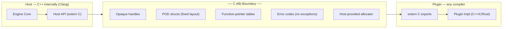
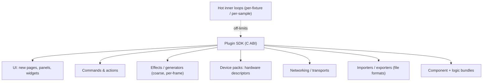

# eZeGo — Native Plugin System (C ABI)

> **Status:** Living document / proposal. Last updated 2026-10-04.
> **Companions:** [`philosophy.md`](./philosophy.md) · [`application-architecture.md`](./application-architecture.md) · [`threading-and-timing.md`](./threading-and-timing.md) · [`linking.md`](./linking.md) · [`ui-system.md`](./ui-system.md)
> **Scope:** This document is **only** about *native, compiled C/C++ (or any C-ABI-capable language) plugins* — code a developer builds into a shared library and the host loads at runtime. The in-app **node/graph "blueprint" editor is a different, data-driven mechanism and is explicitly out of scope here.**

---

## 1. Two kinds of extensibility — keep them separate

eZeGo has two unrelated extension machines that share only the word "extensibility":

| | **Node-graph "blueprints"** *(not this doc)* | **Native plugins** *(this doc)* |
|---|---|---|
| Form | Serialized graph **data** | Compiled shared library (`.so`/`.dll`/`.dylib`) |
| Author | End users, in-app, no compiler | Developers, with a compiler |
| Trust | Sandboxed, safe by construction | Powerful, runs native code |
| License | Shareable user content | **Enables proprietary / closed-source** |
| Mechanism | Interpreted/compiled by the node runtime | Loaded across a **C ABI** boundary |

This document covers the right-hand column exclusively.

---

## 2. Why a pure C ABI

The C++ ABI is **unstable across compilers and STL versions** — Clang and MSVC mangle names differently, handle exceptions differently, and lay out `std::string`/`std::vector` differently. If any C++ type crosses the plugin line, a plugin built with a different toolchain corrupts.

A **pure C ABI** is *stable per platform* (it's just the platform calling convention), and eZeGo is 64-bit-only, which eliminates the legacy 32-bit calling-convention mess. The result is the liberating property:

> **The host can be Clang-only; plugins can be built with anything** (Clang, GCC, MSVC, Rust, Zig) that respects the platform C ABI.

**Boundary rules (invariants):**

- Exports are `extern "C"`; **no C++ name mangling** crosses the line.
- Only **opaque handles, POD structs with fixed/asserted layout, and function-pointer tables** cross.
- **No exceptions across the boundary** — the C API returns error codes; plugins wrap their internals in `try/catch` at the edge.
- **No `std::` types** cross — pass `const char*` + length, or POD spans.
- **The host provides the allocator** — all plugin allocations go through host-supplied functions so memory is symmetric, **tagged, tracked, and torn down on unload** (ties into the memory system; see [`philosophy.md`](./philosophy.md) §3.2).
- **Interface structs are versioned and append-only** — never reorder or remove fields; new capability = new field or new extension ID.



**Prior art to mirror:** **CLAP** (audio plugin standard — the cleanest modern template: header-only, MIT, host-services + plugin-capabilities + string-ID extensions), **Godot GDExtension**, **OBS Studio** plugins.

---

## 3. Lifecycle

```mermaid
sequenceDiagram
    autonumber
    participant Host
    participant Loader
    participant Plugin as Plugin (.so/.dll/.dylib)

    Host->>Loader: scan plugin directory
    Loader->>Plugin: dlopen / LoadLibrary
    Loader->>Plugin: ez_plugin_abi_version()
    alt ABI compatible
        Loader->>Plugin: ez_plugin_register(host_api*)
        Plugin->>Host: query services by string id
        Plugin->>Host: register hooks / declare capabilities
        Host->>Plugin: ez_plugin_activate(ctx*)
        Note over Host,Plugin: plugin runs; allocates via host allocator (tagged to ctx)
        Host->>Plugin: ez_plugin_deactivate(ctx*)
        Host->>Plugin: ez_plugin_unload()
        Loader->>Plugin: dlclose
    else incompatible
        Loader->>Host: reject + log (no load)
    end
```

- **Activation/deactivation are distinct from load/unload** — a plugin can be loaded and dormant, then activated on demand (matches the "mode of activation/deactivation" want).
- **Teardown is guaranteed** — because plugin allocations are tagged to its context, the host can reclaim everything on unload even if the plugin is sloppy.

---

## 4. What plugins can hook into

Plugins extend eZeGo at **coarse granularity** — per-frame, per-event, per-document — **never** inside the per-fixture/per-sample hot loops. That call is an un-inlinable indirect jump across the ABI; putting it in the inner loop violates the same rule that bans virtuals there (see [`philosophy.md`](./philosophy.md) §2.2 & §2.8).



| Hook surface | What a plugin contributes | Typical thread |
|---|---|---|
| **UI** | New pages, dockable panels, widgets inside the app frame, through the C function table of the UI system's widget and canvas layers ([`ui-system.md`](./ui-system.md)); never Dear ImGui directly | Main (display) |
| **Commands/actions** | New invocable operations, keybindable | Main |
| **Effects / generators** | New effect types evaluated once per frame over a target set | Main, or worker for heavy eval |
| **Device packs** | A hardware *driver descriptor*: discover / capabilities / build+flash firmware / stream — the natural meeting point of the plugin and hardware visions (see [`application-architecture.md`](./application-architecture.md) §Hardware service layer) | Worker (discovery/flash), Output (stream) |
| **Networking / transports** | New output transports (e.g. a custom protocol) | Output / worker |
| **Import/export** | New project/asset file formats | Worker |
| **Component bundles** | A complete set of components + logic registered together | Mixed |

---

## 5. Memory, scope & sandboxing

- A plugin receives an **`ez_plugin_ctx*`** — an opaque handle representing *its* scope. All host calls and allocations are made through it.
- **Allocations are tagged to the context** → tracked in memory stats, attributable to the plugin, and reclaimable on unload.
- **State access is capability-scoped, by handle/ID, never by raw pointer.** A plugin cannot reach arbitrary engine internals; it can only touch what its granted capabilities expose, referenced through stable IDs. This is what the handle/POD data model buys the plugin boundary.
- **Permission model for non-permissive plugins** (filesystem, network, device access) is intended but its depth is **open** (see §7).

---

## 6. Illustrative skeleton (sketch — not the final API)

```c
/* ez_plugin.h — the SDK is pure C; this header is all a plugin includes. */
#define EZ_PLUGIN_ABI_VERSION 1u

typedef struct ez_plugin_ctx ez_plugin_ctx;   /* opaque: this plugin's scope */

/* Host services handed to the plugin — append-only, never reordered. */
typedef struct {
    void* (*alloc)(ez_plugin_ctx*, size_t size, const char* tag);
    void  (*free) (ez_plugin_ctx*, void* ptr);
    void  (*log)  (ez_plugin_ctx*, int level, const char* msg);
    /* register_panel, register_command, register_device_pack, ... appended later */
} ez_host_api;

/* Every plugin exports exactly these (C linkage, no exceptions escape): */
EZ_EXPORT uint32_t ez_plugin_abi_version(void);              /* return EZ_PLUGIN_ABI_VERSION */
EZ_EXPORT int      ez_plugin_register(const ez_host_api* h); /* query services, declare caps */
EZ_EXPORT int      ez_plugin_activate(ez_plugin_ctx* ctx);
EZ_EXPORT void     ez_plugin_deactivate(ez_plugin_ctx* ctx);
EZ_EXPORT void     ez_plugin_unload(void);
```

```c
/* my_plugin.c — built with ANY toolchain; links nothing of the host but this header. */
static const ez_host_api* g_host = NULL;

uint32_t ez_plugin_abi_version(void) { return EZ_PLUGIN_ABI_VERSION; }

int ez_plugin_register(const ez_host_api* h) {
    g_host = h;                 /* keep host vtable; register hooks/capabilities here */
    return 0;                   /* 0 = ok; negative = error code */
}

int ez_plugin_activate(ez_plugin_ctx* ctx) {
    g_host->log(ctx, /*INFO*/2, "my_plugin activated");
    void* buf = g_host->alloc(ctx, 4096, "my_plugin/scratch"); /* tagged, tracked */
    (void)buf;
    return 0;
}

void ez_plugin_deactivate(ez_plugin_ctx* ctx) { (void)ctx; }
void ez_plugin_unload(void) { g_host = NULL; }
```

---

## 7. Assumptions & open questions

- **The concrete hook API surfaces** (panel registration, command registration, device-pack descriptor, effect interface) are **not yet designed** — only the shape and the rules are.
- **ABI version & compatibility policy** (how long old plugins keep working, how extensions are negotiated) needs to be specified; CLAP's string-ID extension model is the leading candidate.
- **Threading guarantees to plugins** — exactly which thread each hook is invoked on, and what re-entrancy/locking guarantees the host provides — must be pinned down (proposed defaults in §4).
- **Permission / sandboxing depth** for non-permissive plugins (filesystem, network, device access prompts) is intended but **undecided**.
- **Hot-reload** of plugins during development (a big DX win) is desirable but **unscoped**.
- **Distribution & discovery** (where plugins live, signing/trust, a registry) is **out of scope for now**.
- **Static vs dynamic linking of the host's own vendored libs** interacts with plugins (symbol collisions, duplicated runtimes). **Proposed 2026-10-04:** static host that exports no symbols, with isolation rules for plugins — see [`linking.md`](./linking.md) §6.
- **The plugin UI surface**: a plugin cannot call the host's Dear ImGui directly. **Proposed 2026-10-05:** plugins use the C function table of eZeGo's own UI API (widgets and canvas), not an exposed ImGui — see [`ui-system.md`](./ui-system.md). The concrete table is designed with the widget vocabulary, after the UX designs.
