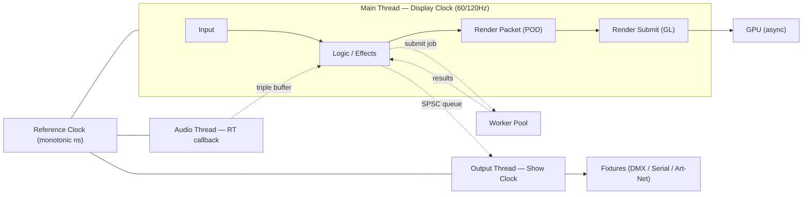
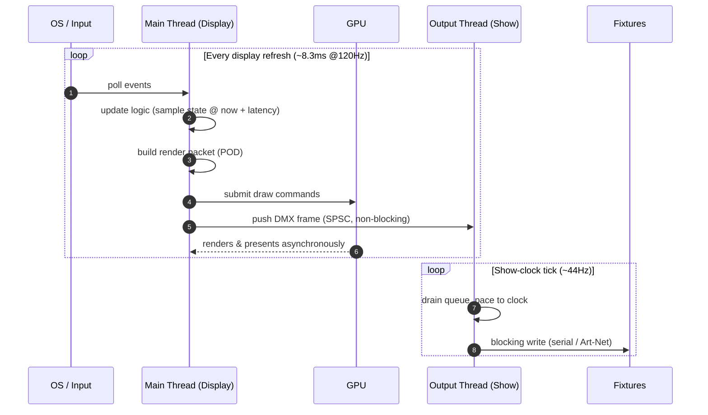
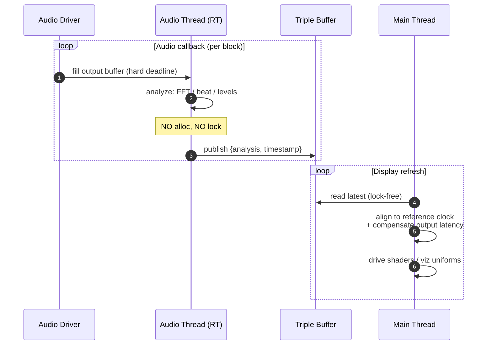
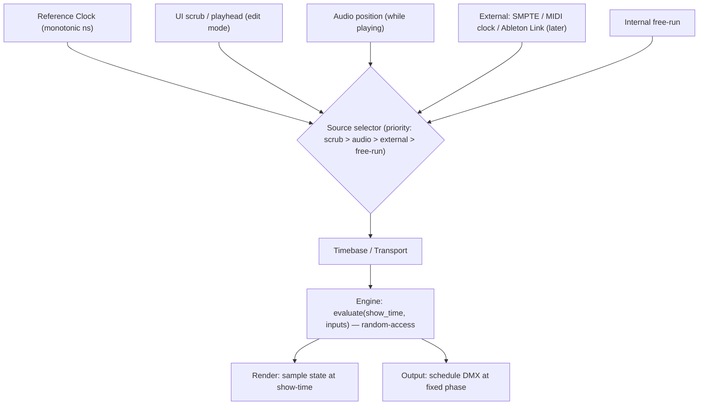

# eZeGo — Threading & Timing Model

> **Status:** Living document / proposal. Last updated 2026-06-05.
> **Companions:** [`philosophy.md`](./philosophy.md) · [`application-architecture.md`](./application-architecture.md) · [`plugins.md`](./plugins.md)
> **Decision status:** The *model* below is agreed as our working hypothesis. The *thread counts and budgets are to be validated by measurement* before they harden.

---

## 1. Core principle

**Multithread along timing domains, not code modules.** You add a thread because something owns a *different clock* with a *different deadline* — not because two subsystems live in different files. Every other threading decision in eZeGo derives from this.

The corollary that makes it tractable: **every cross-domain handoff is a lock-free transfer of immutable POD snapshots** (double/triple buffering or SPSC queues). Because the domain model is handle/POD-based (see [`philosophy.md`](./philosophy.md) §2.3), a snapshot is a cheap `memcpy` of arrays — not a deep graph walk under a lock.

---

## 2. The timing domains (clocks)

| Domain | Clock | Owns | Allocation rule |
|---|---|---|---|
| **Display / Frame** | Vsync / 60–120 Hz | Input, logic, effect eval, render-command submission, ImGui | No hot-path heap alloc |
| **Audio** | Driver callback (block rate) | Playback + analysis (FFT, beat, levels) | **Zero alloc, zero lock** (hard real-time) |
| **Show / Output** | DMX refresh (~30–44 Hz) or hardware-paced | Pacing + blocking IO to fixtures | Pre-allocated buffers |
| **Workers** | No fixed clock | Project load/save, hardware flash, heavy compute | Job-local arenas |

Two consequences worth stating plainly:

- **Audio is not ours to schedule** — the OS calls us back on a high-priority thread with a hard deadline. Music is *already* parallel by design.
- **While we are on OpenGL, all rendering must stay on the Display thread** — GL contexts are thread-affine and multithreaded GL is a trap. This is *why we do not build a render thread yet*; the seam (see §6) lets us add one later on Vulkan.

---

## 3. One display frame (the hot loop)

The Display thread is a classic game loop: **sample inputs → update logic → produce a render packet → submit to GPU**. The GPU then renders *asynchronously* — the CPU does not wait on it. Output and audio run on their own clocks and only exchange POD snapshots.

> Note: a low-poly stage with decent lights/shadows is a *light GPU load*; the CPU cost is only *recording* the draw commands. "3D on the same thread as the UI" does not put the rendering on the CPU thread — only the submission.

---

## 4. Audio ↔ visual synchronization

The hard problem is **not parallelism — it is time alignment**: making the visuals match the music. The audio thread timestamps each analysis block against the reference clock and publishes into a triple buffer; the Display thread reads the latest and compensates for the audio driver's reported output latency.

---

## 5. The master clock (timebase)

This refines the "one master clock everyone measures against" idea. It is three separate things kept deliberately distinct:

1. **Reference clock** — one monotonic, nanosecond-resolution source with a single epoch shared across threads. Everyone *timestamps* against it. **Foundational; built now.**
2. **Timebase / transport** — maps reference-time → *show-time* (bar/beat/SMPTE position, with play/pause/scrub/tempo). Its **source is pluggable, selected by priority: UI scrub/playhead (edit mode) > audio playback position > external signal > internal free-run.** During authoring the UI playhead drives show-time; during playback audio drives it. **Thin seam now; external sources later.**
3. **Phase alignment** — the inflexible clock is the master; the flexible ones slave to it. **Audio cannot be adjusted (dropouts are fatal), so audio is the natural master while it plays;** rendering and output (which *we* control) phase-align to it. When audio is stopped, the UI scrub or internal free-run takes over.

**The master clock is a scheduling/measurement reference, not a forcing function.** We do *not* lockstep the threads. Each domain free-runs and resamples/interpolates to the timebase. The payoff: once every domain timestamps against one reference, we can *measure each domain's latency and pre-compensate* — e.g. pre-roll a cue so the light lands **on** the perceived beat instead of 17 ms behind it.

**Time-addressable evaluation.** The engine samples the timebase's `show_time` each tick and evaluates content *at it* (random-access — supports scrub, loop, and seek), rather than only integrating forward by `dt`. Baked and parametric layers are pure functions of `show_time` (deterministic, seekable); reactive layers also consume the live input sampled at that tick. This is what makes a pre-programmed channel ride the music: its values are looked up at the audio-locked `show_time`. See [`application-architecture.md`](./application-architecture.md) §3 for the evaluation model and the layer compositor.

---

## 6. The seam to build now (defer the threads)

Build the **render-packet boundary** today: each frame, logic produces a compact POD description of "what to draw," and the renderer consumes *only that*. Today it is one thread calling across the seam. The day we move to Vulkan (graphics backend swap) and want threaded command recording or a true render thread, we slot it in **without rewriting logic**.

> Build the seam; defer the thread. The same applies to the worker pool — design the job-submission interface, but don't spin up the pool until a measured workload (heavy effect eval, project load) justifies it.

---

## 7. Synchronization toolbox (shared vocabulary)

| Primitive | Use |
|---|---|
| **Triple buffer** (latest-wins) | Audio analysis, state snapshots — reader always gets a consistent recent value, never blocks |
| **SPSC ring buffer** | Command / DMX-frame / log streams between exactly two threads |
| **Seqlock / atomic generation counter** | A single latest value read without a lock |
| **N-buffered GPU resources + fences** | Never CPU-stall waiting on the GPU |
| **Job system + dependency DAG** *(future)* | Parallelize independent work (per-fixture effect eval). Candidate: **enkiTS** (MIT, minimal). Reference: Naughty Dog "Parallelizing the Engine Using Fibers" |

---

## 8. Worked example — "brighten a group while music plays and DMX outputs"

A user drags a slider that raises the intensity of a fixture group, while a track plays and the rig is live:

1. **Display thread** reads the slider, writes the new intensity into the POD state pool (by group → fixture IDs), records an undo command (old/new value by ID).
2. Same thread evaluates effects for this frame, **samples** the latest audio analysis from the triple buffer (for any audio-reactive component), builds the render packet, and submits GPU draws for the viewport.
3. Same thread serializes the resulting DMX frame and **pushes it into the SPSC queue** to the Output thread (non-blocking).
4. **Output thread**, paced to the show clock, drains the queue and performs the **blocking** serial/Art-Net write — never touching the frame budget.
5. **Audio thread** continues filling buffers and publishing analysis, entirely independently.

No locks are held across any step in steady state; the only shared mutations are lock-free POD handoffs.

---

## 9. Assumptions & open questions

- **Single-threaded logic+UI+render is a hypothesis.** It assumes the 16 ms / 8.3 ms budget comfortably absorbs input + logic + ImGui draw-list build + render submission for a low-poly scene. **To be validated by measurement.**
- **Thread counts are not final.** Audio (mandatory) and Output (strongly advised for blocking IO) are near-certain; the Worker pool is introduced on demand; a dedicated Render thread is deferred until Vulkan.
- **Queue sizes, triple-buffer policies, and per-domain latency budgets are unspecified** and will be tuned empirically.
- **External timebase sources** (SMPTE/MTC/MIDI-clock/Ableton Link) are designed-for but **not implemented now**.
- **Plugin threading rules** — which thread plugin hooks run on (UI hooks → main; heavy work → workers) — are defined in [`plugins.md`](./plugins.md) but the enforcement model is **open**.
- **Content time-indexing & the layer taxonomy** (seconds vs beats, the compositor's layer set) are decided in [`application-architecture.md`](./application-architecture.md) §3 & §9; the user's detailed layer list is **pending**.
- **High-resolution monotonic clock** is currently a *stub on Linux*; implementing it is one of the first foundation tasks and is a hard prerequisite for everything above.
