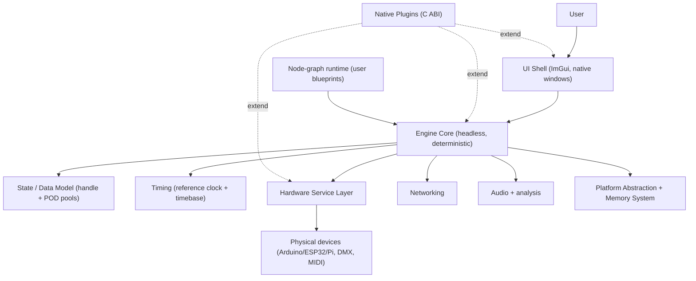
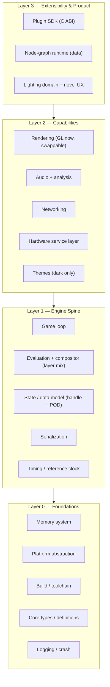
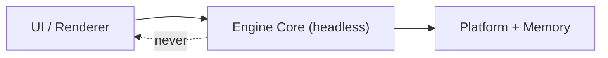
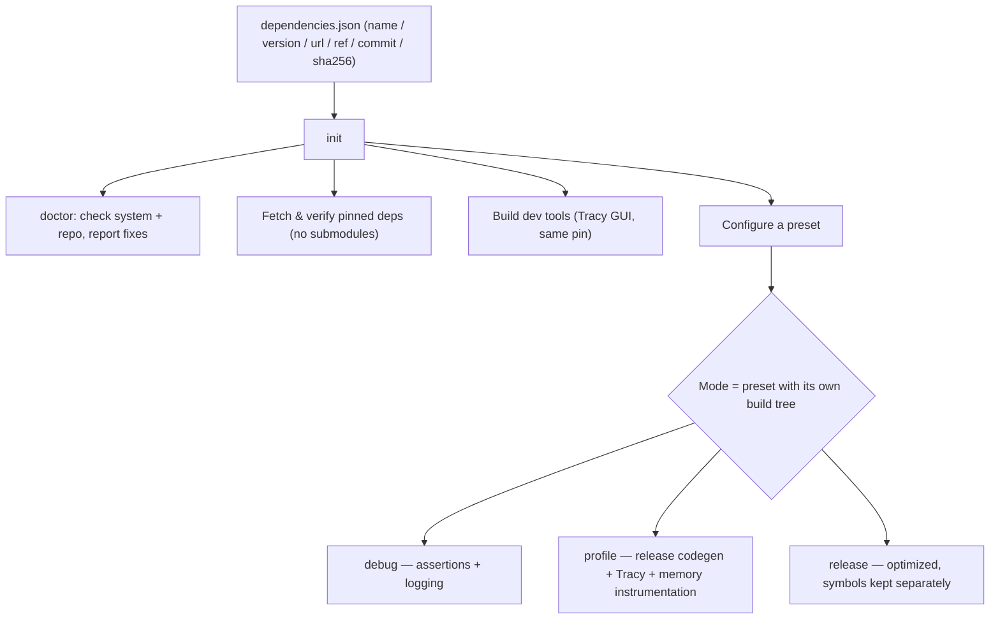

# eZeGo — Application Architecture

> **Status:** Living document. Last updated 2026-10-04. Reflects what we know now; expected to be revised as the domain model and UX are detailed.
> **Companions:** [`philosophy.md`](./philosophy.md) · [`threading-and-timing.md`](./threading-and-timing.md) · [`plugins.md`](./plugins.md) · [`build-system.md`](./build-system.md) · [`linking.md`](./linking.md) · [`observability.md`](./observability.md) · [`ui-system.md`](./ui-system.md) · index: [`README.md`](./README.md) · source-of-intent: [`things I want.md`](./things%20I%20want.md)

---

## 1. System-level view

eZeGo is a **game-engine-shaped desktop application**: a frame-time-aware loop that registers input, computes logic, and renders — with a **headless, renderer-agnostic core** at its center, a UI shell on top, a **hardware service layer** for talking to physical devices, and two extension surfaces (native plugins + the node-graph runtime).



---

## 2. Layered architecture

The dependency rule is absolute: **arrows point inward.** UI depends on the engine; the engine never depends on the UI. The core must build, run, and be tested with no GPU, window, or ImGui present.



| Layer | Responsibility | Notes |
|---|---|---|
| **L0 Foundations** | Memory, platform abstraction, build/toolchain, core types, logging | *Use-case-independent — built first.* |
| **L1 Engine spine** | The loop, the time-addressable evaluation + layer compositor, the data model, serialization, the clock | Headless + deterministic constraint lives here |
| **L2 Capabilities** | Rendering, audio, networking, hardware service, themes | Built behind seams |
| **L3 Extensibility & product** | Plugin SDK, node runtime, the actual lighting domain + UX | Built last, but **their seams constrain every layer below** |

How these layers map onto directories, namespaces and build targets, and which modules exist in each, is in [`code-organization.md`](./code-organization.md) *(proposed 2026-10-08)*.



> **Two 'late' features cast shadows backward:** the **plugin ABI** and **headless testability**. We implement them last, but every foundation must leave room for them now.

---

## 3. The per-frame pipeline — loop, evaluation & compositing

### 3.1 The loop

A traditional engine loop, aware of the previous frame's compute time, single-threaded for UI+logic+render (see [`threading-and-timing.md`](./threading-and-timing.md) for why, and for the audio/output/worker domains that live off this thread). Note it is **time-addressable**: the engine evaluates content at a *show-time* sampled from the timebase, not just integrated forward by `dt`.

```
while running:
    dt         = clock.delta()                   # monotonic reference clock
    input      = platform.poll()
    show_time  = timebase.now()                  # source: scrub > audio-position > free-run
    state      = engine.evaluate(show_time, input)   # see 3.2
    packet     = engine.build_render_packet(state)   # POD description of what to draw
    renderer.submit(packet)                      # GPU renders async
    output.publish(engine.dmx_frame(state))      # lock-free handoff to the Show thread
```

The **render-packet seam** (logic produces POD, renderer consumes it) is built now so a future render thread / Vulkan backend slots in without rewriting logic.

### 3.2 Time-addressable evaluation

The engine is, as much as possible, a **pure function of `(show_time, live_inputs, project)`** — random-access, not forward-only. This is required for a sequencer/timeline UX (the user scrubs, loops, and jumps the playhead) and it is a *gift* for testing: pure-in-`show_time` evaluation is **deterministic**, exactly the property [`philosophy.md`](./philosophy.md) §3.4 needs for scenario/simulation tests.

- **Baked + parametric** content is pure in `show_time` (seekable, deterministic).
- **Reactive** content depends on live input, so it is *not* bit-reproducible. For tests, treat live input as a **recorded, replayable stream** — then the whole pipeline is deterministic in the harness.
- **Content is indexed in show-time (seconds or musical beats), not render frames.** Render frames are a rendering concern and the framerate is a variable 60–120. Physical timing precision is bounded by the **output refresh** (~22 ms at 44 Hz DMX, coarser/jittery on consumer serial links), not the render rate — design the UX to not promise more than the transport delivers.

### 3.3 The layer compositor

Mixing pre-programmed, parametric, reactive, and event-driven lighting is a **layer stack with blend modes**. The compositor evaluates each layer to channel values, then merges overlapping channels by **layer priority/opacity + blend mode**. Merge semantics live with the *attribute type* (lighting's classic default: **Highest-Takes-Precedence** for intensity, **Latest-Takes-Precedence** for color/position), generalizing to blend modes (add / max / multiply / override / crossfade).

> ⚠️ **Speculative layer taxonomy (placeholder).** The list below is for initial scoping only. The user maintains a **detailed layer list** that will supersede this once shared — treat these as illustrative categories, not the final set:
>
> | Category | Evaluates as |
> |---|---|
> | Baked timeline | `lookup(curve, show_time)` — keyframes/curves over show-time |
> | Parametric generator | `gen(show_time, params)` (e.g. a pulsing fade mask) |
> | Reactive | `react(live_inputs)` (FFT / beat / MIDI, sampled now) |
> | Discrete event | fires over the interval `[last_show_time, now]`; emits a transient envelope `f(time_since_trigger)` |

Evaluation + compositing is per-channel arithmetic — SIMD-friendly, and embarrassingly parallel over channels if a large rig ever exceeds the single-thread budget (jobify via the worker seam).

---

## 4. Platform abstraction layer

Everything OS-specific sits behind a **capability-based** interface that *exploits* platform advantages and falls back gracefully (see [`philosophy.md`](./philosophy.md) §2.7). Current/intended responsibilities:

| Concern | Abstraction | Notes |
|---|---|---|
| **Entry** | A plain `main()` in `src/apps/<name>/main.cpp` that wires modules ([`code-organization.md`](./code-organization.md) CO-6); `WinMain` and app-bundle entries come with packaging | Present |
| **Memory** | platform alloc / aligned alloc → memory system | Thin wrappers today; expands with use |
| **Clock** | monotonic, ns-resolution reference clock | **Linux impl is currently a stub — first foundation task** |
| **Windowing** | `Window`/`Display` over **GLFW** | OS-native frames/title bars; multi-window, multi-monitor, DPI. *Nothing else in the app talks to GLFW directly* — so custom chrome or an SDL3 swap is a one-module change |
| **Filesystem** | abstracted; **all paths normalized to unix form** | Windows paths translated/handled like Linux; home/temp/config/system locations normalized |
| **Hardware comms** | USB / WiFi / Bluetooth transports | Higher protocols (e.g. MIDI) built atop these; see §6 |
| **Console / logging sink** | per-OS | ANSI on Linux/mac, console API on Windows |

**Compiler / arch / OS detection** lives in `src/ez/base/detect.h`, primitive types in `types.hpp`, attribute macros in `macros.hpp` ([`base.md`](./base.md)). Current stances:

- **64-bit only** (enforced).
- **Clang-primary**, including **clang-cl on Windows** for one toolchain across all platforms; MSVC supported as fallback. *(GCC currently hard-errored — softening is open.)*
- **C++17** *(move to C++20/23 is open).*

---

## 5. Build & toolchain model

> **Proposed 2026-10-04.** The full design, with trade-offs, lives in [`build-system.md`](./build-system.md) and [`linking.md`](./linking.md). This section is a summary. Where it differs from the earlier `make` / `FetchContent` / `RelWithTracyProfiler` wording, those documents are the reference.

Goal: **self-maintaining, reproducible, minimal-friction builds** — CMake + Ninja, a single dependency manifest replacing git submodules, and one-word commands that behave the same on all three platforms.



- **Dependency manifest** — one human-readable file lists every dependency with name, version, source URL, tag/branch and **pinned commit**. The tag or branch is recorded for humans; **the commit is what the build pins** (reproducibility is incompatible with tracking a moving branch). Fetched by an explicit step (`init` / `deps`); configure and build never touch the network. *No git submodules.*
- **Developer commands** are plain CMake (`cmake -P scripts/<task>.cmake`, `cmake --workflow --preset <mode>`, `ctest --preset <mode>`) with an optional `ez` launcher. OS-specific work lives in `scripts/linux`, `scripts/macos`, `scripts/windows`; commands unsupported on a platform fail clearly.
- **Build modes** are presets, each with its own build tree, so switching never requires clearing a cache: *debug* (assertions, logging), *profile* (release code generation plus Tracy zones, frame marks and memory instrumentation; **no global `malloc` hook outside this mode** — see [`observability.md`](./observability.md) §4), *release* (optimized, debug/trace logging compiled out).
- **Current vendored libs** (to migrate off submodules into the manifest): ImGui (docking), GLFW, RtMidi, Tracy, nlohmann/json, IconFontCppHeaders, function2. Boost is currently a `find_package` system dependency used only for serial — **proposed for removal** under the minimal-deps philosophy.
- **Linking: static** for everything built from source. Only OS, GPU, windowing and audio interfaces stay dynamic; plugins are the one first-class dynamic boundary, with isolation rules for symbol visibility and duplicated state. See [`linking.md`](./linking.md).

---

## 6. Capabilities (Layer 2)

- **Rendering** — OpenGL 4.1 core + ImGui (docking, viewports) today. Kept behind a backend seam so DirectX/Vulkan is swappable *if* the graphics API ever becomes the measured bottleneck. The in-app low-poly 3D stage designer and 2D/shader visualizations render here (GPU-bound, parallel to CPU).
- **Audio** — playback + real-time analysis (FFT/beat/levels) on the audio thread. Library choice (**RtAudio** — sibling of vendored RtMidi — vs **miniaudio**) is open.
- **Networking** — fast, non-blocking, multi-protocol (Art-Net/sACN and general transport). Stack is open; leaning a minimal UDP layer over Boost.Asio.
- **Hardware service layer** — the integration tier between the abstract engine and physical devices. The **core knows only abstract, capability-tagged outputs**; the service layer owns device **discovery**, **capability negotiation**, **vendor-SDK orchestration** (e.g. `arduino-cli`, `esptool` as subprocess + filesystem + network work → worker pool), **compatibility checks**, and **firmware build/flash pipelines**. Each device class is effectively a **driver descriptor**: `{ discover, capabilities, build+flash, stream }`. This is also a natural plugin seam ("device packs" — see [`plugins.md`](./plugins.md) §4).
- **UI system** — the application and plugins never call Dear ImGui; everything goes through `ez_ui`, an immediate-mode API in eZeGo's own vocabulary with three layers (widgets and layout, canvas, viewport). Viewports are render targets; scene and gizmo logic stays in the render and editor-tool systems. Design: [`ui-system.md`](./ui-system.md) *(proposed 2026-10-05)*.
- **Themes** — dark themes only (light themes left to the community). A **single theme file** loaded at runtime alters colors and UI shapes as far as ImGui allows.

---

## 7. State, serialization & extensibility (Layers 1 & 3)

- **Data model** — handle/ID into POD pools (the keystone). The previous experimental action/undo system is **discarded** and will be rewritten as **command objects over stable IDs** (no captured `this`, no dangling on delete, cheap to snapshot and serialize). Layers, curves/keyframes, and parametric effect parameters all live in these POD pools, referenced by handle; the **compositor** (see §3.3) merges them per frame.
- **Serialization** — the entire user project (project files, settings, themes, node-graph components) is serializable to a file for sharing. Handle/POD makes this clean (IDs serialize trivially). Format/lib TBD (nlohmann/json is vendored; binary format is a possible perf path later).
- **Extensibility** — two distinct machines: **native plugins** (C ABI, [`plugins.md`](./plugins.md)) and the **node-graph "blueprint" runtime** (user-authored, data-driven, version-stable, shareable). They share nothing but the word.

---

## 8. Testing & headless mode

The headless constraint (engine core has no GPU/window/UI dependency) exists *specifically* to make this possible:

- **Automated before every merge to `main`:** unit, integration, e2e, **scenario/simulation** (deterministic project + inputs ⇒ deterministic output), and smoke tests.
- **Manual:** UI testing.
- Frameworks and the full list of test kinds: [`testing.md`](./testing.md) *(proposed 2026-10-08)*.

---

## 9. Assumptions & open questions (consolidated)

- **C++ standard** (17 vs 20/23) — open.
- **Vendor static vs dynamic linking** — proposed: static; see [`linking.md`](./linking.md) (awaiting confirmation).
- **Boost** — removal proposed ([`build-system.md`](./build-system.md) B-7); replace serial/networking with lighter pieces — to confirm.
- **Audio library** (RtAudio vs miniaudio) — open.
- **Networking stack** — open.
- **Testing frameworks** — open.
- **Domain model concrete shape** (fixtures/groups/scenes/cues/patches, node-graph component format) — **not yet designed**; only the handle/POD *style* is decided.
- **Compositor layer taxonomy** — the user maintains a **detailed layer list (pending)**; the categories in §3.3 are speculative placeholders for initial scoping only.
- **Content time-index** — seconds vs musical beats (lean: beats for music-ride content, seconds option for beginners) — open.
- **Mixing mental model** — explicit layer stack (Resolume/Photoshop-like) vs a novel UX presentation — open.
- **Per-attribute merge defaults** — HTP-intensity / LTP-color as default, blend-mode-overridable — to confirm.
- **Novel UX specifics** — largely unspecified; will reshape Layer-1 decisions when detailed. The UI widget vocabulary waits for them ([`ui-system.md`](./ui-system.md) U-8).
- **GCC support** — currently blocked; softening is open.
- **Serialization format** (JSON vs binary, versioning/migration) — open.
- **Performance budgets** throughout — starting hypotheses, to be validated by measurement.
