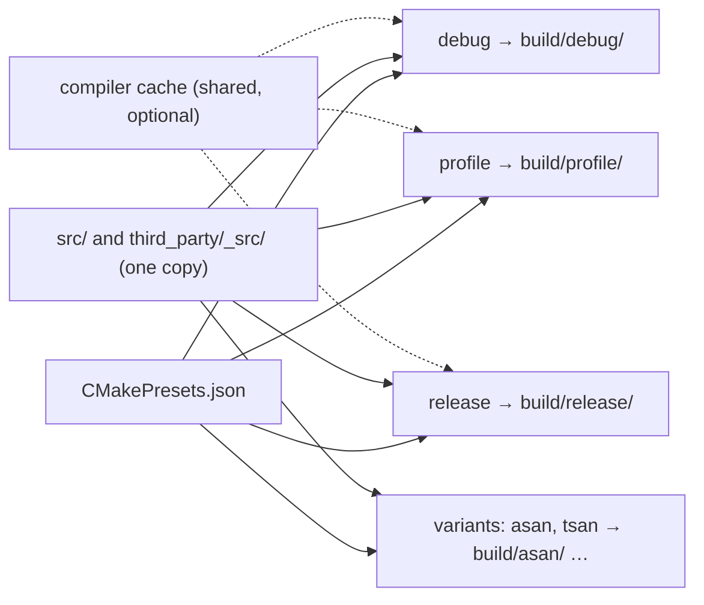
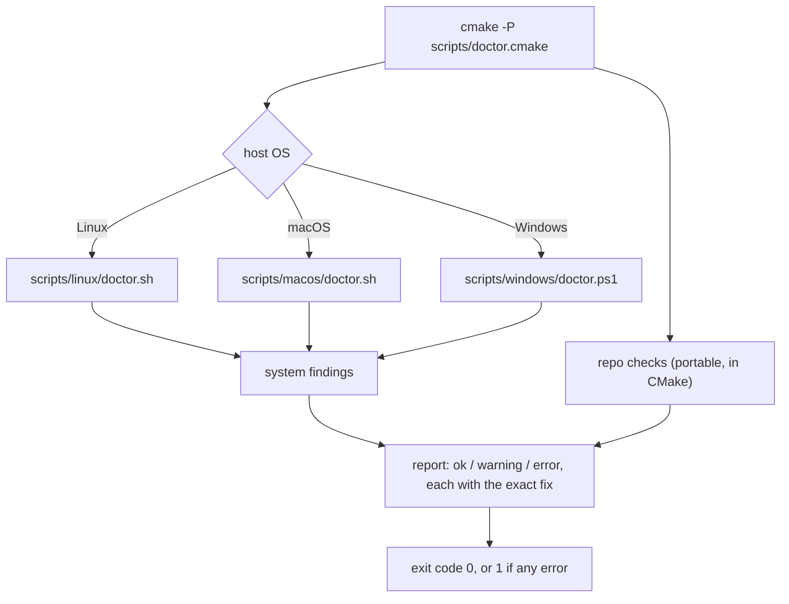
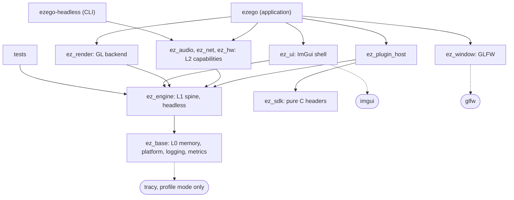

# eZeGo — Build System & Developer Experience

> **Status:** Accepted and implemented, 2026-10-05 (proposed 2026-10-04). How-to pages: [`../docs/`](../docs/). Decision IDs (`B-n`) are indexed in [`README.md`](./README.md).
> **Companions:** [`philosophy.md`](./philosophy.md) · [`application-architecture.md`](./application-architecture.md) · [`linking.md`](./linking.md) · [`observability.md`](./observability.md)
> **Scope:** how the repository is set up, configured, built, tested and switched between modes on Linux, macOS and Windows. Snippets are sketches, not final code.

---

## 1. What is wrong today

Found by reading the prototype's CMake files and git metadata. CMake is not installed on the machine used for this review, so the CMake findings are from reading, not from a run.

| Symptom | Cause in the prototype |
|---|---|
| Switching Debug ⇄ profile needs the cache wiped | There is one build directory, so one `CMakeCache.txt`. `option(TRACY_ENABLE …)` in `libs/CMakeLists.txt` only supplies a *default*: once a value is in the cache, later configures never change it. Whichever mode was configured first wins until the cache is deleted. |
| The profile build measures unoptimized app code | `CMAKE_CXX_FLAGS_RELWITHTRACYPROFILER` is set inside `libs/CMakeLists.txt`, so it exists only in that directory's scope and in sub-directories added after it. The `eZeGo` target (root scope), GLFW and RtMidi get no `-O` flag and no `NDEBUG`; `definitions.hpp` then classifies the build as `EZ_DEBUG_BUILD`. Only ImGui and Tracy are optimized. |
| A setting that does nothing | `CMAKE_CONFIGURATION_TYPES … FORCE` is read only by multi-config generators. Under Ninja it has no effect. |
| "Everyone gets a different version" | Partly true. The seven submodules *are* pinned: git stores an exact commit for each. But six of the seven pins are untagged commits, so nobody can say which *version* they are. Boost comes from the system through `find_package`, so it really is whatever each machine has. The test project uses a system `nlohmann_json` instead of the vendored one. |
| Modes overwrite each other | Every mode writes its binary to the same `bin/` folder. |
| New files are silently ignored | `file(GLOB_RECURSE)` is evaluated at configure time only, and it compiles all three `plat_*.cpp` files on every OS. |
| Tests are a separate world | `test/CMakeLists.txt` is a second `project()` that duplicates settings and is not connected to the main build. |

None of these is a CMake limitation. They are all structural, and the decisions below remove each one.

### Three different things called "cache"

The request "use the cache efficiently, but don't let it block mode switching" mixes three mechanisms that need opposite treatment:

| Cache | What it remembers | Treatment |
|---|---|---|
| **Configuration cache** (`CMakeCache.txt`) | Option values chosen at configure time | **Isolate per mode.** This is the one that forced the wipes. |
| **Incremental build state** (Ninja's graph and object files) | What is already compiled | **Keep per mode**, so returning to a mode is incremental. |
| **Compiler cache** (ccache / sccache) | Compiler output keyed by input and flags | **Share globally**, across trees, branches and worktrees. |

---

## 2. Goals

1. One command after `git clone` tells a developer exactly what is missing, on their OS, with the fix.
2. `debug`, `profile` and `release` can be switched at any time with no cleaning and no reconfiguring by hand.
3. One readable file lists every dependency with name, version, source and pinned commit. No submodules.
4. Builds are fast: incremental by default, cached where possible, measured.
5. The same commands work on Linux, macOS and Windows, from a terminal and from VS Code.
6. The build graph enforces the architecture (headless core, inward dependencies) so it cannot erode silently.

---

## 3. Decisions

### B-1 — Keep CMake + Ninja

**Decision.** CMake stays as the build system, Ninja as the generator on all three platforms. Minimum CMake version **3.28** (what the prototype already requires, and what Ubuntu 24.04 ships). The floor is raised only when a specific feature earns it.

**Why.** Every dependency we use ships a CMake build or needs none. VS Code, CLion and Visual Studio read CMake presets natively. Plugin authors will expect a CMake package for the SDK. Presets solve the mode problem directly (B-2).

**Alternatives considered.**

| Option | Why not now |
|---|---|
| Meson | Cleaner language, but our dependencies and future plugin authors are CMake-based, and editor support is thinner. |
| xmake | Good built-in package manager and modes; small ecosystem and one more tool for every contributor. |
| Bazel / Buck2 | Hermetic builds and remote caching, at a setup and maintenance cost that pays off only for much larger teams. |
| Premake / hand-written Ninja | No presets, weak editor integration; we would rebuild what CMake already provides. |
| `make` as the command layer (earlier idea in `things I want.md`) | Not present on stock Windows, and CMake's script mode already covers the same job on all three OSes. |

**Cost.** CMake's language stays awkward. We contain it by keeping all build logic in a small `cmake/` folder with one job per file.

### B-2 — A mode is a preset with its own build tree

**Decision.** `CMakePresets.json` defines the modes. Each preset configures into its own directory, `build/<preset>/`. The custom build type `RelWithTracyProfiler` is removed.



```jsonc
// sketch of the idea, not the final file
{ "name": "_base", "hidden": true, "generator": "Ninja",
  "binaryDir": "${sourceDir}/build/${presetName}",
  "toolchainFile": "${sourceDir}/cmake/toolchain.cmake" },
{ "name": "debug",   "inherits": "_base", "cacheVariables": { "EZ_MODE": "debug",   "CMAKE_BUILD_TYPE": "Debug" } },
{ "name": "profile", "inherits": "_base", "cacheVariables": { "EZ_MODE": "profile", "CMAKE_BUILD_TYPE": "Release" } },
{ "name": "release", "inherits": "_base", "cacheVariables": { "EZ_MODE": "release", "CMAKE_BUILD_TYPE": "Release" } }
```

**Why this ends the cache wipes.**

- Each tree has its own `CMakeCache.txt`, so one mode can never leak into another.
- Each tree keeps its own objects, so switching back to a mode is an incremental build, usually a no-op.
- A preset sets exactly one project variable, `EZ_MODE`. `cmake/modes.cmake` derives everything else from it as normal (non-cache) variables on every configure, so nothing mode-dependent can go stale.
- Third-party options such as `TRACY_ENABLE` are set as normal variables by our wrapper immediately before the dependency is added (B-8), so their `option()` calls cannot latch onto an old cached value.

**Why no custom build type.** A custom `CMAKE_BUILD_TYPE` is unknown to every third-party CMake file and needs its flag variables defined in every scope; that is exactly the bug in §1. `CMAKE_BUILD_TYPE` now only takes standard values, and "profile" is a project-level concept.

**Why not Ninja Multi-Config** (one tree, `--config X`). Instrumentation switches like `TRACY_ENABLE` are configure-time options in upstream CMake files, not per-configuration ones, so they would have to be rewritten as generator expressions. Sanitizer variants need separate trees anyway.

**Cost.** Disk space (each tree holds its own objects; size to be measured) and third-party code compiles once per tree.

**Platform differences stay out of preset names.** `debug` means the same thing on every OS. Compiler and linker selection per host lives in `cmake/toolchain.cmake`, so there is no `linux-debug` / `windows-debug` matrix to remember. Presets that cannot work on a platform (for example `tsan` on Windows) carry a `condition` and are hidden there.

### B-3 — Three modes, plus variants

| | `debug` | `profile` | `release` |
|---|---|---|---|
| Purpose | Write and debug code | Measure | Ship |
| `CMAKE_BUILD_TYPE` | Debug | Release | Release |
| Optimization, first-party | Off | **Identical to release** | Full |
| Optimization, third-party | On by default (toggle) | Identical to release | Full |
| Debug info | Full | Full | Full, split into separate symbol files |
| Frame pointers | Kept | Kept | Kept |
| Assertions | On | Off | Off |
| Logging | All levels | Info and above | Info and above; debug/trace compiled out *(was warnings and above; changed 2026-10-08, [`logging.md`](./logging.md) §1.2)* |
| Always-on metrics | On | On | On |
| Tracy zones, allocation events | Off | **On** | Compiled out |
| Catch-all allocation hooks | Off | On | Off |

See [`observability.md`](./observability.md) for what the instrumentation rows mean.

**Rules.**

- **Profile must measure what ships.** `profile` and `release` share one set of optimization flags, defined once in `cmake/modes.cmake`. We do not use CMake's `RelWithDebInfo`, because its defaults differ from `Release` (`-O2` instead of `-O3` on Clang, reduced inlining on MSVC-style drivers), which would make the profile build measure different code.
- **Code tests features, not modes.** Source code checks `EZ_ASSERTS`, `EZ_PROFILER`, `EZ_MEM_TRACE`, `EZ_LOG_LEVEL`. The mode → feature mapping lives in one CMake file. A personal `CMakeUserPresets.json` (git-ignored) can make "debug with Tracy on" without touching the project.
- **Link-time optimization is adopted only if it moves a measured metric.** If it is adopted for `release`, `profile` gets it too.
- **Frame pointers stay on in every mode.** They cost roughly 1–2 % on x86-64 and make sampling profilers and crash stacks reliable. To be validated by measurement.
- The earlier `RelWithDebInfo` mode is dropped: `release` always produces symbols, kept beside the binary rather than inside it.

**Variants** are extra presets with their own trees, not extra modes:

| Variant | What | Platforms |
|---|---|---|
| `asan` | `debug` + Address and Undefined-Behavior sanitizers | All three |
| `tsan` | `debug` + Thread sanitizer, for the lock-free handoffs in [`threading-and-timing.md`](./threading-and-timing.md) | Linux, macOS |
| `rtsan` *(candidate)* | Clang's RealtimeSanitizer (LLVM 20+): reports allocation, locks and blocking calls inside functions marked non-blocking. A mechanical check of the audio thread's "zero alloc, zero lock" rule. Availability per toolchain to be verified. | Linux, macOS |

### B-4 — Command surface

CMake has no `cmake run <task>` verb. It offers three mechanisms, and each fits a different job:

| Mechanism | Works without a configured build tree | Used for |
|---|---|---|
| `cmake -P <script>` (script mode) | Yes | `doctor`, `init`, `deps`, `tools`: things that must work before the project can configure |
| `cmake --workflow --preset <mode>` | Creates it | Configure and build a mode in one command |
| `ctest --preset <mode>` | No | Tests |

**Decision.** The canonical commands are plain CMake. An optional launcher `ez` (`ez` for bash, `ez.cmd` for Windows) maps short words onto them. It may chain two canonical commands (`test` builds the tree first), fill in the default preset, and validate its arguments, but it holds no build logic: every command's help prints the canonical commands it runs. *(Revised 2026-10-08: the help text lives in `scripts/help.cmake`, one source for both launchers, with a page per command, the real preset list read from CMake, labels, options and examples.)*

| Intent | Canonical command | With the launcher |
|---|---|---|
| Health check | `cmake -P scripts/doctor.cmake` | `./ez doctor` |
| First-time setup | `cmake -P scripts/init.cmake` | `./ez init` |
| Sync dependencies to the manifest | `cmake -P scripts/deps.cmake` | `./ez deps` |
| Configure and build a mode | `cmake --workflow --preset profile` | `./ez build profile` |
| Rebuild only | `cmake --build --preset profile` | `./ez build profile` |
| Run tests | `cmake --build --preset debug` then `ctest --preset debug [options]` | `./ez test [preset] [ctest options]` |
| The GPU tests | `ctest --preset gpu` | `./ez test gpu` |
| Pre-merge gate | `cmake --workflow --preset check` | `./ez check` |
| Lint | `cmake -P scripts/lint.cmake` | `./ez lint [--fix]` |
| Benchmarks | `cmake -P scripts/bench.cmake` | `./ez bench` |
| Run the app | `build/<mode>/bin/ezego` | `./ez run profile` |
| Profiling session | (three steps by hand) | `./ez profile`: build `profile`, start the Tracy GUI, launch the app |
| Install dev tools | `cmake -P scripts/tools.cmake` | `./ez tools` |
| Remove a mode's tree | delete `build/<mode>/` | `./ez clean profile`, `./ez clean all` |
| Help | `cmake -P scripts/help.cmake [command]` | `./ez help [command]`, `./ez <command> --help` |

**Why a launcher at all.** `cmake -P scripts/doctor.cmake` is correct but not memorable. The launcher is the same pattern as `gradlew`: checked in, zero prerequisites beyond CMake, and its help is the first thing a newcomer reads, so it carries the explanations the canonical commands cannot.

**Cost.** One more thing in the repo root. It is optional by construction: CI and editors call the canonical commands.

### B-5 — `scripts/` layout

```
scripts/
├─ doctor.cmake  init.cmake  deps.cmake  tools.cmake   # entry points, identical on every OS
├─ lib/                 # shared CMake helpers: manifest parsing, report formatting
├─ linux/               # doctor.sh, env.sh
├─ macos/               # doctor.sh, env.sh
└─ windows/             # doctor.ps1, env.ps1
```

**Rule.** A per-OS script contains only what is truly OS-specific: package-manager detection, SDK discovery, environment activation. Anything portable is written once in the CMake entry points. This prevents three drifting copies of the same logic.

The entry points detect the host and dispatch:



**Windows detail.** `clang-cl` needs the MSVC libraries and the Windows SDK on its search paths. `scripts/windows/env.ps1` locates the Visual Studio Build Tools install and loads that environment, so commands work from any terminal and not only from a "Developer PowerShell".

### B-6 — `doctor` and `init`

**`doctor`** is read-only. It never installs anything. For each failed check it prints the exact command for the detected package manager.

| Group | Checks | Severity if missing |
|---|---|---|
| Core tools | CMake ≥ floor, Ninja, Clang ≥ floor, linker | Error |
| Platform SDK | Linux: C library headers. macOS: Xcode Command Line Tools, arm64 host. Windows: Build Tools (MSVC libraries) and Windows SDK | Error |
| Windowing and audio headers (Linux) | X11, Wayland, xkbcommon, OpenGL, ALSA / PulseAudio / JACK development packages | Error |
| Accelerators | Compiler cache, `mold` | Warning |
| Device access (Linux) | User in the serial-port group, udev rules for USB devices | Warning |
| Dependencies | Manifest parses; every dependency present and at its pinned commit; no leftover submodule state | Error |
| Dev tools | Each tool installed at its pinned version; provenance shown (B-14) | Warning |
| Build trees | A tree configured with a compiler that no longer matches | Warning |

**`init`** runs `doctor`, fetches dependencies, installs the dev tools (verified prebuilt or built from source, B-14; `--tools=skip` for CI) and configures the `debug` preset. It is idempotent: re-running is always safe.

Every normal configure repeats the cheap dependency check, so a tree can never silently build against stale third-party code. If the manifest and the fetched sources disagree, configure stops and names the command to run.

**Cost.** Three per-OS scripts to maintain. The portable-logic rule in B-5 keeps them short.

### B-7 — One dependency manifest, explicit fetch, no submodules

**Decision.** `dependencies.json` at the repository root is the single source of truth. A fetch step (`deps`, also run by `init`) fetches each dependency into `third_party/_src/<name>/`, which is git-ignored and shared by all build trees, as a **shallow git fetch of exactly the pinned commit: no history**. **Configure and build never touch the network.**

```json
{
  "name": "imgui",
  "version": "1.92.9b-docking",
  "url": "https://github.com/ocornut/imgui",
  "ref": "v1.92.9b-docking",
  "commit": "<40-character commit hash>",
  "license": "MIT",
  "used_by": ["app"],
  "why": "Immediate-mode UI with docking and multi-viewport"
}
```

| Field | Meaning |
|---|---|
| `version`, `ref` | For humans: the release and the tag or branch it came from |
| `commit` | What is actually pinned, and the integrity check: git verifies content against it. A branch name is never a pin. |
| `sha256` | Only for things fetched as files rather than from git: prebuilt tools and release archives |
| `license` | Must be compatible with static linking into an MIT application |
| `used_by` | `app`, `profile`, `tests` or `tools`; lets a mode skip what it does not need |
| `prebuilt` | Optional, tools only: per-platform download URL and its SHA-256 (B-14) |
| `why` | Mandatory justification, per philosophy §2.2 |

JSON is chosen because CMake, PowerShell and every scripting language parse it natively, which also leaves the door open for licence and SBOM reports.

**How the fetch works.** For each entry: skip if `third_party/_src/<name>/` is at the pinned commit and clean. Otherwise `git init`, `git fetch --depth 1 <url> <commit>`, `git checkout FETCH_HEAD`, apply any patches from `third_party/patches/<name>/`, write the stamp. No history is downloaded; a dependency's `.git` holds one commit.

- This is our own script rather than CMake's `FetchContent`, because `FetchContent` cannot shallow-clone a commit hash and falls back to a full clone.
- GitHub serves any reachable commit by hash. For a host that does not, the fallback is a depth-1 fetch of `ref`, after which the result must **equal** the pinned commit or the fetch fails. A moved branch can never pass silently.
- Because each dependency is a git checkout, `doctor` can report "imgui has local modifications" and `git diff` inside it is the natural way to prepare a patch.

**Options compared.**

| Option | Good | Bad for us | Verdict |
|---|---|---|---|
| Git submodules (today) | Exact pins, no extra tooling | Versions unreadable, no single manifest, easy to forget `--recurse-submodules`, full histories cloned | Replace |
| CMake `FetchContent` | Built in, familiar | Downloads during configure, once per build tree unless redirected; commit pins force full clones; `doctor` cannot verify before configure | Close, but wrong moment to fetch |
| CPM.cmake | One-line declarations, source cache | Same configure-time model; adds a script | Viable alternative |
| vcpkg / Conan | Large catalogs, binary caches | The package decides how the library is built. We need per-mode flags, allocator injection and instrumentation inside our dependencies ([`observability.md`](./observability.md) §4). Extra bootstrap tooling. | Not a fit |
| Sources committed into the repo (as Godot does) | Fully hermetic, works offline forever | Repository history grows, updates are noisy diffs | Honest runner-up |
| **Manifest + explicit shallow fetch** | One file, offline builds, verifiable by `doctor`, no history, full control of how each library is compiled | We own a small fetch script; no shared download cache across clones | **Chosen** |

**Why git and not archives.** Host-generated archives (GitHub's `/archive/<commit>.tar.gz`) are not contractually byte-stable; GitHub changed them briefly in January 2023 and reverted. A shallow fetch of the commit has no such drift: the commit hash *is* the integrity check. What it gives up is a trivial shared download cache across clones and worktrees; shallow fetches are small, so this is accepted, and a per-user mirror cache can be added later if it ever hurts.

**Rules.**

- Pin to a release tag. A non-release commit needs its reason stated in `why`.
- No `find_package` of system libraries for anything we link statically. Boost is removed. The only system dependencies are platform SDKs (OpenGL, X11/Wayland, audio servers, Cocoa, Win32).
- Prefer a library's configuration hooks over patching it. Patches are a last resort and are listed in the manifest.

**Current state, to migrate** (upstream tags as observed on 2026-10-04):

| Dependency | Pinned today | On a release tag? | Newest upstream tag |
|---|---|---|---|
| imgui (docking branch) | `3064e6d` | No | `v1.92.9b-docking` |
| glfw | `b35641f` | No | `3.5.1` |
| rtmidi | `24b3a3b` | No | `6.0.0` |
| tracy | `5d542dc` | Yes, `v0.11.1` | `v0.14.1` |
| nlohmann/json | `a3143f5` | No | `v3.12.0` |
| function2 | `43fc0ca` | No | `4.2.5` |
| IconFontCppHeaders | `8a38118` | Upstream has no tags | n/a |
| Boost | System `find_package` | Unpinned | Remove |

### B-8 — We own the build description of every dependency

**Decision.** Each dependency gets one small tracked file, `third_party/<name>.cmake`, that defines its target. Small or CMake-less libraries (ImGui, the header-only ones) get a target written by us. Libraries with a non-trivial upstream build (GLFW, Tracy) are added through their own CMake files with their options set by our wrapper.

**Why.** This is where per-mode behaviour is applied uniformly: optimization policy, warnings silenced through system include paths, our allocator hooks, and profile-only definitions. It also keeps configure fast, since we skip upstream test and example logic.

**Cost.** When an upstream release adds a source file, our target must follow. For the libraries concerned this happens rarely.

### B-9 — The target graph enforces the architecture

**Decision.** Each architectural module is its own static-library target with an explicit source list. Platform-specific sources are selected by CMake, not by compiling every file and hiding it behind `#ifdef`.



Module names and granularity are illustrative. The rule is what matters:

- `ez_engine` has no include path to ImGui, GLFW or OpenGL. Engine code that includes a UI header **fails to compile**. The "arrows point inward" rule in [`application-architecture.md`](./application-architecture.md) §2 becomes a build error instead of a review comment.
- Tests and the headless runner link the engine without any windowing library. Headless testability becomes a link-time fact.
- `ez_sdk` headers are additionally compiled as C in the test build, so the plugin ABI cannot accidentally acquire a C++ construct.
- Sources are compiled once per tree and linked into the app, the headless runner and the tests.

**Explicit source lists instead of globbing.** Adding a file means adding a line. In exchange, the build always knows about every file, and a module's contents are reviewable in one place.

### B-10 — Fast builds

| Measure | What it buys | Status |
|---|---|---|
| Ninja everywhere | Fast no-op and incremental builds | Decided |
| Compiler cache as launcher (ccache or sccache, auto-detected, optional) | Clean rebuilds, branch switches, new worktrees and CI reuse earlier output | Decided; `doctor` recommends it |
| Fast linker: `mold` on Linux (fallback `lld`), `lld-link` on Windows, Apple's linker on macOS | Linking is the dominant incremental cost of a statically linked app | Decided |
| Debug-info settings that keep links fast (split DWARF on Linux, embedded debug info on Windows, which the compiler cache also requires) | Shorter links | Decided, tune by measurement |
| Third-party code optimized even in `debug` | A usable frame rate while debugging our own code | Default on, toggle |
| Precompiled headers, unity builds | Shorter clean builds; can hide missing includes | Deferred until measured |
| C++20 modules | n/a | Not used: toolchain and build support still uneven. With C++20 enabled, CMake ≥ 3.28 scans every source for modules by default; set `CMAKE_CXX_SCAN_FOR_MODULES OFF` (found by the experiment: the scan fails without `clang-scan-deps`) |

The compiler cache does not make the *first* build of a mode faster, because different modes use different flags. Its value is everything after that.

**Build time is a tracked metric**, in the spirit of philosophy §3. Starting hypotheses, to be validated:

| Metric | Target |
|---|---|
| No-op build | ≤ 0.5 s |
| Edit one first-party `.cpp`, rebuild `debug` | ≤ 3 s |
| Switch to a mode that is already built | 0 s of rebuilding |
| Clean build of one mode, warm compiler cache | ≤ 30 s |
| Clean build of one mode, cold | ≤ 3 min |

Tools for finding slow spots: Clang's `-ftime-trace` with ClangBuildAnalyzer, and Ninja's own build log.

### B-11 — Toolchain per platform

| | Linux | macOS | Windows |
|---|---|---|---|
| Architecture | x86-64 | arm64 only | x86-64 |
| Compiler | Clang (upstream) | Apple Clang (Xcode Command Line Tools) | `clang-cl` (LLVM) |
| C++ standard library | libstdc++ | libc++ (part of the OS) | MSVC STL |
| Linker | mold, fallback lld | Apple `ld` | lld-link |
| System SDK | glibc plus windowing and audio development packages | macOS SDK frameworks | Windows SDK and MSVC libraries from Build Tools |

One compiler family means one warning set and one optimizer to reason about. The three platforms still use **three different C++ standard libraries**, so the STL profiled on Linux is not the STL users run on Windows. That reinforces philosophy §2.2: the less the hot path leans on `std::`, the more portable the measurements.

GCC is unsupported but unblocked: `-DEZ_ALLOW_GCC=ON` lets the toolchain accept it, detection never rejects it (`detect.h` is shared with plugins, which may use any compiler), and nothing promises it stays green. Minimum compiler versions and OS floors are open questions (§6).

### B-12 — Tests

- `ctest --preset <mode>` runs tests in any mode's tree. Tests are part of the main project, not a second one.
- Labels select subsets: `unit`, `integration`, `smoke`, `lint` and `gpu` today; `scenario`, `fuzz`, `soak` and the rest as [`testing.md`](./testing.md) adds them. Example: `ctest --preset debug -L unit`.
- Tests link the headless modules only. Anything that needs a GPU is labelled `gpu`, excluded by the mode presets, and run on demand through the `gpu` test preset (`./ez test gpu`).
- A `check` workflow preset (configure, build, test) is the pre-merge gate. CI runs the same canonical commands as developers.
- The test framework: doctest, proposed in [`testing.md`](./testing.md) T-1, which also extends the label list above.

### B-13 — Editor integration: VS Code as a complete UI, generated by `init`

**Decision.** Everything a developer can do from the terminal can be done by clicking in VS Code, and both run the same canonical commands. `init` generates the machine-specific part; nothing tracked in git contains a machine-specific path.

| | Tracked in git | Generated by `init` (git-ignored) |
|---|---|---|
| Files | `.vscode/tasks.json`, `launch.json`, `extensions.json` | `eZeGo.code-workspace` |
| Content | Tasks for `doctor`, `init`, `deps`, `tools`, `profile`; debug configurations with static per-OS blocks; recommended extensions (CMake Tools, clangd, a debugger) | Discovered paths and machine settings: CMake, Ninja, clangd, compiler, the installed Tracy GUI, the pinned `clang-format`; project settings such as where the active preset's compile database is copied for clangd |
| Rule | **Zero machine-specific paths.** Tracked files refer to `${config:ezego.*}` values and to CMake Tools variables such as `${command:cmake.launchTargetPath}` | Writes the `ezego.*` values. Regenerated by every `init` and `tools` run (tool paths change with versions). Header says "generated, do not edit". |

**Why a workspace file and not `.vscode/settings.json`.** VS Code merges workspace settings with folder settings, so `init` can own one file completely while `.vscode/settings.json` stays the developer's personal space. The existing `.gitignore` already ignores `.vscode/*` except the three tracked files; the workspace file is added to it.

**What the UI covers.** Mode switch (the preset picker in the status bar); build, run and debug (F5; CodeLLDB on Linux and macOS, the Microsoft C++ debugger on Windows for PDB files); tests in Test Explorer through CMake Tools' CTest support, filtered by label; a "Profile" task that builds `profile` and launches Tracy from the discovered path; `doctor`, `init`, `deps` and `tools` as tasks; format on save with the pinned `clang-format`; clickable compiler errors through problem matchers.

**Revision 2026-10-05 (from use).** Relying on the generated workspace failed in practice: opening the repository *folder*, the natural action, left clangd without a compile database and every file red. Now the folder works on its own: a tracked `.clangd` points at `build/compile_commands.json`; CMake keeps that path linked to the most recently configured preset (`cmake/editor.cmake`; a copy refreshed on build on Windows); a tracked `.vscode/settings.json` holds machine-independent defaults only, and tasks call `cmake` from `PATH`. The generated workspace remains optional, for machine paths such as the Tracy binary.

**Fit.** Presets remain the contract, so CLion and Visual Studio work without any generated file. VS Code is the one editor we generate for. Every button maps one-to-one onto a canonical command, so the terminal and the UI cannot diverge.

**Cost.** A small generator in `scripts/` to maintain, and VS Code setting names occasionally change.

### B-14 — Development tools: fetched, pinned, installed once

Three categories, three homes. Tools are programs we *run* during development, not code compiled into the app.

| Category | Examples | Who provides it | Home |
|---|---|---|---|
| System prerequisites | Ninja, Clang, platform SDKs | The developer; `doctor` reports what is missing and prints the install command | Not in the repo |
| Dependencies | ImGui, GLFW | `init` / `deps` | `third_party/` |
| Development tools | Tracy profiler GUI | `init` / `tools` | Recipes in `tools/`, binaries in a per-user directory |

**Decision.**

- `tools/` (tracked) holds one recipe per tool, for example `tools/tracy.cmake`: where its source or prebuilt comes from (the manifest), how to build it, and which binaries must exist afterwards. `scripts/tools.cmake` runs the recipes.
- A tool is pinned in `dependencies.json` like any dependency, with `tools` in `used_by`. Tracy has **one** entry, used by the `profile` build (client library) and by `tools` (GUI, `tracy-capture`, `tracy-csvexport`). Client and GUI must share a protocol version; one pin makes drift impossible.
- Binaries are installed **per user, keyed by version**, for example `~/.cache/ezego-dev/tools/tracy-0.14.1/`, not under `build/`. The per-user root is `ezego-dev`, never `ezego`: that name is reserved for the application's own data. A second clone or git worktree finds them already installed. `doctor` verifies that the installed version matches the pin.
- **Prebuilt first, source second.** The manifest may list a `prebuilt` download per platform as a URL **plus SHA-256**. "Trusted" means the hash in the manifest, not the host name. If a verified prebuilt exists for this OS it is used. A hash mismatch counts as "does not exist", is reported loudly, and is never used. Otherwise the tool is built from the pinned source. Tracy v0.14.1 publishes prebuilt binaries for all three OSes (Linux AppImage + CLI tools, macOS `.app`, Windows `.exe`), so every platform can download in seconds; the Linux AppImage is extracted at install time so it runs without FUSE. *(Corrected 2026-10-05 by the experiment; an earlier draft said Windows only.)*
- Each installed tool directory carries a `PROVENANCE.json` (outside the repo, so never tracked): tool, version, `origin` (`prebuilt` or `source`), URL or commit, hash, date, host. It exists for humans. `doctor` prints it as "tracy 0.14.1 (prebuilt, verified)" or "(built from source)". Nothing else reads it: a prebuilt and a source-built tool are interchangeable to `ez profile` and to `doctor`.
- `init` offers the choice only when a prebuilt exists for this OS and a terminal is attached. `--tools=prebuilt|source|skip` answers without a prompt, which is what CI and unattended runs use. When no prebuilt exists, `init` says so and builds.
- A tool that fails to download or build is a **warning**, never an `init` failure. Tools have their own system requirements (verified 2026-10-05: Tracy's GUI source build on Linux needs libcurl or OpenSSL, freetype, EGL and libffi development packages; `doctor` reports them as warnings) and must never block building the app. Building a tool is the one documented step besides `deps` that may use the network, because Tracy's GUI build fetches its own dependencies.

**Admission rule.** Only tools whose **exact version matters** belong here. Tracy qualifies: the protocol must match the client. A pinned `clang-format` qualifies: no formatting churn between contributors. RenderDoc, `perf` and Instruments do not; any version works, so they stay system prerequisites. Without this rule the folder turns into a second package manager.

**What else fits.** `tracy-capture` for headless captures (CI perf runs, or a show machine without a GUI); `tracy-csvexport` for the regression pipeline in [`observability.md`](./observability.md) §7; pinned `clang-format` and `clang-tidy`; ClangBuildAnalyzer for the build-time budgets in B-10. First-party utilities (a fake Art-Net receiver, a virtual-fixture viewer) are **not** tools in this sense: they are ordinary targets under `src/tools/`, built in every tree.

**`ez profile`** builds the `profile` tree, starts the Tracy GUI with auto-connect, and launches the app. Personal overrides (port, remote address, extra arguments) live in a git-ignored user config, in the same spirit as `CMakeUserPresets.json`.

**Cost.** One recipe per tool and a small per-user cache. The admission rule keeps both small.

### B-15 — Contributor documentation lives in `docs/`

**Decision.** `specs/` (formerly `.agent/`) holds design intent and decisions. `docs/` holds task-shaped how-to pages for contributors: `getting-started.md` (clone, `init`, build), `build-modes.md`, `profiling.md`, `dependencies.md` (how to bump a pin), `tools.md`. Each page is written once the commands it describes exist, so every snippet can be copied and verified.

**Why.** Design documents explain *why*; contributors mostly need *how*. Mixing the two makes both harder to keep true.

**Cost.** Two places to touch when a command changes. The how-to pages stay short and point to the design documents for reasoning.

---

### B-16 — Language standard: C++20

**Decision.** `CMAKE_CXX_STANDARD 20`, extensions off, no C++23 features. Decided 2026-10-08; the build had used it since 2026-10-05 while the philosophy still said C++17.

**Why.** The foundations lean on it: designated initializers for cvar declarations, `__VA_OPT__` in the log macros, `constinit` for the cvar objects, `if constexpr` and `std::span`. All three standard libraries we ship with (libstdc++, libc++, MSVC STL) support C++20 fully at the compiler floor of B-11; C++23 support is uneven across them, so a C++23 feature would be a per-platform risk.

**Cost.** None today. Revisited when every toolchain floor has complete C++23 support and a feature earns it (`std::expected` is the likely first).

## 4. Proposed repository layout

```
eZeGo/
├─ CMakeLists.txt            # thin: project(), includes, add_subdirectory
├─ CMakePresets.json         # the modes (tracked)
├─ CMakeUserPresets.json     # personal overrides (git-ignored)
├─ dependencies.json         # the manifest
├─ ez  ez.cmd                # optional launcher
├─ cmake/                    # build logic: modes, toolchain, warnings, helpers
├─ scripts/                  # doctor / init / deps / tools + linux/ macos/ windows/
├─ third_party/
│  ├─ imgui.cmake glfw.cmake …   # our target definitions (tracked)
│  ├─ patches/
│  └─ _src/                  # fetched sources (git-ignored)
├─ tools/                    # dev-tool recipes (tracy.cmake …); binaries install per user (B-14)
├─ src/                      # one folder per module, one target each
├─ sdk/                      # public plugin headers, pure C
├─ tests/
├─ docs/                     # contributor how-to pages (B-15)
├─ specs/                    # design intent and decisions
├─ build/                    # git-ignored: debug/ profile/ release/ asan/
├─ .vscode/                  # tasks, launch, extensions (tracked, no machine paths)
└─ eZeGo.code-workspace      # generated by init with discovered paths (git-ignored)
```

---

## 5. A first day, end to end

```bash
git clone <repo> && cd eZeGo

cmake -P scripts/init.cmake          # or: ./ez init
#   doctor: reports anything missing, with the install command for this OS
#   deps:   fetches and verifies every dependency in dependencies.json
#   tools:  installs the Tracy GUI: verified prebuilt if one exists for this OS, else built from the pinned source
#   then configures build/debug/

cmake --workflow --preset debug      # or: ./ez build
ctest --preset debug                 # or: ./ez test

cmake --workflow --preset profile    # first time: full build into build/profile/
cmake --workflow --preset debug      # back to debug: nothing to rebuild
```

---

## 6. Open questions

| # | Question | Lean |
|---|---|---|
| 1 | Ship the `ez` launcher, or canonical CMake commands only? | Both; the launcher is optional sugar |
| 2 | Manifest format: JSON, or a declarative CMake file (allows comments, but only CMake can read it)? | JSON |
| 3 | ~~Fetch by archive + SHA-256, or shallow `git fetch` of the exact commit?~~ Decided 2026-10-05: shallow `git fetch`, no history (B-7) | — |
| 4 | Should `doctor` ever install packages on request (`--fix`)? | No; print the command |
| 5 | x86-64 baseline: `x86-64-v2` with runtime dispatch for AVX2 kernels, or `x86-64-v3` (AVX2 required)? Low-end laptop CPUs without AVX2 are still common, which matters for the "consumer floor" in philosophy §1. | v2 + runtime dispatch on the few hot kernels |
| 6 | OS floors: minimum macOS version, Windows 10 build, and the Linux C-library baseline (set by the distro that release builds run on) | Decide when packaging starts |
| 7 | C++ standard: stay on 17 or move to 20 (designated initializers, `std::span`, `<bit>`, concepts)? | C++20, without modules |
| 8 | Test framework | Open |
| 9 | GCC: keep the hard `#error`, or "unsupported but unblocked"? | Keep Clang-only until the foundations are stable |
| 10 | Windows on ARM and Linux on ARM | Not targeted; nothing here blocks them |
