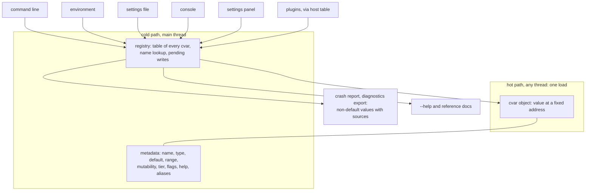

# eZeGo — Runtime Variables (cvars)

> **Status:** Accepted and implemented, 2026-10-08 (`src/ez/cvars/`, how-to in [`../docs/cvars.md`](../docs/cvars.md)). Where the implementation settled a detail differently from the text below, §15 says so. Decision IDs (`CV-n`) are indexed in [`README.md`](./README.md).
> **Companions:** [`logging.md`](./logging.md) (the first consumer; its settings are cvars) · [`observability.md`](./observability.md) (crash and diagnostics reports list non-default cvars) · [`plugins.md`](./plugins.md) §6 · [`linking.md`](./linking.md) L-6 · [`threading-and-timing.md`](./threading-and-timing.md) · [`philosophy.md`](./philosophy.md) §1 (progressive complexity) and §2
> **Scope:** the single registry of application configuration variables: how a variable is declared, stored, read at zero cost, changed, validated, persisted, and shown to users and developers. Project data is out of scope (§10). Identifier names are tentative until the naming convention is confirmed.

---

## 1. What a cvar is (CV-1)

A **cvar** is a typed application setting with a name and enough metadata that every interface to it is a view over one record: the command line, environment variables, the settings file, the in-app console, the settings panel, the crash report and the generated reference. There is exactly one registry. Nothing in the application reads configuration from anywhere else.

Examples of what is a cvar: how often the log thread writes, whether the hardware layer watches for devices being plugged in, which audio backend to use, whether developer mode is on, whether the diagnostics HUD is shown.

What is **not** a cvar: the contents of a project (fixtures, venues, screens, projectors), window layout, keybindings, secrets. Project data is discussed in §10.



---

## 2. The hot path: reading (CV-2)

**Requirement.** Reading a cvar must cost the same as reading an ordinary global: one load, no indirection, no lookup, no metadata touched.

**Design.** Every cvar is one `constinit` static object. Its value sits at offset 0 at an address the linker fixes, so a read compiles to a single PC-relative load. The metadata is reached *from* the object through a pointer that only cold paths follow.

```cpp
template <class T>
class CVar {                       // one static object per variable; constant-initialised, no constructor runs
public:
    T value() const { return value_.load(std::memory_order_relaxed); }   // the hot path: one plain load
    u32 generation() const;        // incremented on every change; owners compare it (§4)
private:
    std::atomic<T> value_;         // offset 0
    State state_;                  // generation, source, the locked flag, and a pointer to the Meta (cold)
};
```

| Operation | Cost | Thread |
|---|---|---|
| `value()` on a scalar | One load, ~1 ns | Any, including audio and output |
| `generation()` compare | One load and a compare, ~1 ns | Any |
| `value()` inside an inner loop | Copy to a local before the loop; the compiler will not hoist an atomic load | |
| Reaching the metadata | One pointer follow; only console, panel, parser and reports do it | Main |
| Lookup by name | Hash map built at init; microseconds | Main |

Scalars are `bool`, `i32`, `i64`, `f32`, `f64` and enums stored as their underlying integer. **Strings** are fixed-capacity inline buffers and cannot be replaced atomically without allocation, so a string cvar is either `Startup` or read only on the main thread; the registry rejects any other combination at registration.

**Why not one contiguous array of all values.** Contiguity does not make a single read faster: a fixed-address load is already the floor. It would help only for snapshotting every value at once, which readers do not need because each read is atomic. The scenario recorder, which does want a snapshot, takes one on the cold path by walking the registry at a frame boundary, about a microsecond per hundred cvars.

---

## 3. Metadata and mutability (CV-3, CV-4)

Every cvar carries, in a `constexpr` record in read-only memory:

| Field | Content |
|---|---|
| Name | Dotted, lowercase, `[a-z0-9_.]`, at most 63 characters: `module.sub.name`. The first segment is the owning module (§7). |
| Type | `bool`, `i32`, `i64`, `f32`, `f64`, `enum`, `string`. Enums carry their value names; strings their capacity. |
| Default | Compile-time constant |
| Range | `min`, `max`, `step` for numbers; the value set for enums; max length for strings |
| Mutability | `Const`, `Startup`, `Live` (table below) |
| Tier | Exactly one of `User`, `Advanced`, `Developer`, `Hidden` (§8) |
| Flags | `Persist`, `Secret`, `ShowCritical` (reserved, §11) |
| Help | One sentence, mandatory; an optional longer text |
| Aliases | Former names, accepted with a deprecation warning (§6.4) |

Mutability says who may set the variable and when the change takes effect.

| Class | Settable from | Takes effect | Examples |
|---|---|---|---|
| `Const` | Nothing; baked at build time | n/a | `app.version`, `app.commit`, `app.mode` |
| `Startup` | Settings file, environment, command line. **Locked once init completes.** The panel may still edit the *persisted* value and shows "takes effect after restart". | Next start | `log.ring_kib`, `audio.api`, `log.file.dir` |
| `Live` | All of the above, the console and the panel | Next frame boundary (§4) | `log.drain_ms`, `hw.watch`, `log.level.net`, `debug.hud`, `app.developer` |

A `Live` cvar that owns resources, such as `audio.device`, is still `Live`: the owner notices the change through the generation counter and re-initialises itself on its own thread (§4). "Live but needs a restart of the owner" is the owner's business, not a fourth class.

---

## 4. Writing: one writer, one moment (CV-5, CV-6)

| Rule | Decision | Why |
|---|---|---|
| Who writes | The main thread only, through the registry | Single writer makes every read a plain load |
| When | Console and panel writes are **queued** and applied at the start of the next frame by `cvars::apply_pending()`. Startup sources write directly during init, before any thread exists. | A value never changes in the middle of an evaluation; every change is frame-stamped; the scenario recorder can replay it on the same frame |
| Queue | Fixed capacity, 64 pending writes of `{cvar, value, source}`; a full queue rejects with a warning | No allocation |
| What a change does | Store the value, increment the generation, record the source, log one Info line `cvar log.drain_ms: 20 -> 50 (console)`, emit a scenario event, schedule a save if `Persist` | |
| Notification | **None.** The registry never calls into systems. An owner that must react compares the cvar's generation with the one it last saw, once per frame or per poll, on its own thread. | Callbacks create re-entrancy and thread-ambiguity bugs; a generation compare costs a nanosecond |
| Cross-thread reads | Scalars through relaxed atomic loads; strings main-thread or `Startup` (§2) | Wait-free, so the audio thread may read `Live` scalars |

A human cannot tell "immediately" from "within one frame", so the frame boundary costs nothing in experience and removes a whole class of bugs.

---

## 5. Validation (CV-7)

Every value, from every source, is validated against the type and range before it is stored. Enum values are matched by name, case-insensitively; numbers are never accepted for enums, so renumbering an enum cannot silently change a setting. Booleans accept `true/false`, `on/off`, `1/0` and are written as `true/false`.

| When | Policy | Decided by Amir, 2026-10-08 |
|---|---|---|
| **Startup**: settings file, environment, command line | **Fail fast.** Every error from every source is collected first, then all are reported together and the process exits with a non-zero code. Nothing starts with a half-applied configuration. | Yes |
| **Runtime**: console, panel, plugin | **Reject and keep the previous value.** The user sees a warning at the point of entry: an inline message in the console, inline validation in the panel. One Warn log line states the accepted range. | Yes |

**Fail fast means a message the user can read, not a crash.** The report names the file and line, or the variable and the offending value, and the accepted range or values. On the desktop it goes to stderr and to a native message box through the platform layer, because an app launched from an icon has no visible stderr. The message offers `--reset-settings`, which backs the file up as `settings.cfg.bad-<date>` and starts with defaults, so a user who cannot edit a text file is never locked out. Since startup validation runs before the logger exists, the registry keeps its startup messages in a fixed buffer and the logger emits them once it is up.

**Unknown names are not bad values.** A name the running build does not know, for example from a newer version or an uninstalled plugin, is preserved in the file and reported once at Warn. Only a *known* name with an invalid value, or a malformed line, is an error.

---

## 6. Sources, precedence and persistence (CV-8, CV-9)

### 6.1 Precedence at startup

```text
defaults  <  settings file  <  environment  <  command line
```

Later sources override earlier ones. After init, any `Live` cvar can be changed from the console or panel regardless of which source set it; the user wins. Unreal's priority ladder, where a console change can be refused because a configuration file set the value, protects less than it confuses.

### 6.2 The command line and the environment come from the registry (CV-14)

| Door | Form | Notes |
|---|---|---|
| Command line | `--log.drain_ms=50`, `--hw.watch=off` | Every `Startup` and `Live` cvar, by name. `--help` is generated from the metadata: name, type, default, range, help, grouped by module. |
| Environment | `EZ_LOG_DRAIN_MS=50` | Dots become underscores, uppercase. Same set of cvars. |
| Shorthands | `--log=all:debug,net:trace`, `EZ_LOG=…` | Curated conveniences for common cases, expanded into ordinary cvar sets ([`logging.md`](./logging.md) §6.2). |

There is no second table of command-line options to drift from the registry.

### 6.3 Provenance

Each cvar records where its current value came from: default, file, environment, command line, console, panel, plugin. The console and panel show it ("set by command line"), `reset` returns to the default, and the crash report and the diagnostics export list every non-default cvar with its source. A `Secret` cvar is redacted everywhere it would be printed.

### 6.4 Persistence

| Aspect | Decision |
|---|---|
| What is saved | **Only explicit overrides** of `Persist` cvars: values the user actually set, from the panel, console or a `--save` on the command line. Never a dump of everything. |
| Why | When a later version changes a default, users who never touched the value follow the new default. |
| File | One per user, in the OS configuration directory: `$XDG_CONFIG_HOME/ezego/settings.cfg`, `~/Library/Application Support/eZeGo/settings.cfg`, `%APPDATA%\eZeGo\settings.cfg`. |
| Format | Flat text, `name = value`, one per line, `#` comments, sorted by name, with a header. Parsed in the base layer with no library. It is exactly what the console's `dump` prints. |
| Writing | Atomic: write a temporary file, then rename. Debounced about one second after the last change, from a worker, never on the frame thread; also on clean shutdown. |
| Unknown keys | Preserved and reported once (§5). A removed plugin's settings survive its absence. |
| Renames | A renamed cvar lists its old name in `aliases`; the old name is accepted from any source with a deprecation warning and rewritten on the next save. |
| Version | The header carries a schema version for future migrations. |

```text
# eZeGo settings. Only values you changed are stored here. Edit while eZeGo is closed.
# schema 1
app.developer = true
audio.api = coreaudio
log.drain_ms = 50
plugin.myfx.gain = 0.5
```

---

## 7. Registration and module identity (CV-11)

- **Explicit, per module.** Each module declares its cvars in its own source file, next to the code that reads them, and exposes `register_cvars_<module>(Registry&)`. One visible list in application init calls these in order. No static-initializer registration ([`linking.md`](./linking.md) L-6); the cvar objects themselves are constant-initialised data and need no constructor.
- **The first name segment is the module** and must exist in the central module table, the same table that generates the log categories ([`logging.md`](./logging.md) §3). One identity per module across cvars, log categories and memory tags: a user filtering the settings panel by "audio" and the console by `audio` is looking at the same thing.
- **Self-checks at registration** in debug builds: the default is inside the range, enum defaults are valid, names are unique and well-formed, the module exists, help is non-empty, string cvars obey the thread rule of §2. A unit test enumerates every cvar and fails on any violation, so hover documentation is never blank.
- **Capacity.** The registry table is fixed at init, 1024 entries proposed, covering first-party cvars and the plugin range.

---

## 8. Tiers and developer mode (CV-10)

Progressive complexity (philosophy §1) applies to settings: the floor sees few, the ceiling sees all.

| Tier | Settings panel | Console | Command line and file |
|---|---|---|---|
| `User` | Shown | Yes | Yes |
| `Advanced` | Behind an "advanced" toggle in the panel | Yes | Yes |
| `Developer` | Only when developer mode is on | Only when developer mode is on | Yes |
| `Hidden` | Never | Yes | Yes |

**Developer mode** is the cvar `app.developer`: `Live`, `Persist`, `User`, **default off**. Any module may read it like any other cvar and show more when it is on: the console, `Developer` cvars, extra panels, extra diagnostics. Tiers control visibility, not settability: the command line and the file always work, so a support instruction never depends on a mode.

---

## 9. Console and settings panel

Both are views over the registry and share one lookup, one validator and one pending queue. The console is the cheap view; the panel is the designed one and waits for the UX work ([`ui-system.md`](./ui-system.md) U-8).

| Console input | Effect |
|---|---|
| `name` | Prints value, default, source, mutability, tier, help |
| `name value` | Validates and queues a write; shows the rejection inline if invalid |
| `name ?` | Full help |
| `find text` | Lists cvars whose name or help contains the text |
| `reset name`, `reset all` | Back to defaults |
| `dump` | Every non-default cvar with source, in settings-file syntax |
| Tab | Completion from the name table |

The panel groups by module, searches name and help, shows the source and a reset button per row, greys out locked `Startup` values with "after restart", and renders a toggle, slider, dropdown or text field from the type and range. The generated reference document comes from the same metadata.

**Console commands** such as "save diagnostics now" are a sibling registry of named actions with help text, sharing the console. Their design is deferred (§11).

---

## 10. Boundary: application configuration only (CV-13)

The registry holds **application** configuration: how the program behaves, independent of which show is loaded.

**Project data**, such as venues, screens, projectors and output refresh rates, lives in the project's data model, is saved with the project, is shared when the project is shared, and is edited through commands that participate in undo. Those are different behaviours from a settings file per user, which is why the two are not merged now. Some project values do affect performance, and the diagnostics panel may show them, but reading them is the engine's business.

What can be reused: the typed-value-plus-metadata engine, the validator, the generated UI. If project settings later need the same treatment, they become a **second instance** of the engine with the project as its persistence, not entries in this registry. Deferred until the domain model and UX make the use cases concrete.

---

## 11. Plugins (CV-12)

Plugins declare cvars through the host table with a C metadata struct that mirrors §3, under `plugin.<id>.`. The host validates the declaration like a first-party one, allocates the object from a preallocated plugin range, and removes it on unload. Persisted values of an absent plugin remain in the file (§6.4). A plugin reads its own cvars through the host table rather than by address; plugin hooks are coarse-grained, so one indirect call per read is acceptable there ([`plugins.md`](./plugins.md) §4).

---

## 12. Usage

```cpp
// ===== src/ez/hw/cvars.cpp : a module's variables live next to its code =====
EZ_CVAR_BOOL(cv_hw_watch, "hw.watch", true,
    { .mutability = Live, .tier = User, .flags = Persist,
      .help = "Watch for devices being plugged in and announce them immediately." });

EZ_CVAR_I32(cv_log_drain_ms, "log.drain_ms", 20,
    { .min = 1, .max = 1000, .mutability = Live, .tier = Advanced, .flags = Persist,
      .help = "How often the log thread writes queued lines, in milliseconds." });

EZ_CVAR_ENUM(cv_audio_api, "audio.api", AudioApi, AudioApi::Auto, audio_api_names,
    { .mutability = Startup, .tier = Advanced, .flags = Persist,
      .help = "Audio backend. Takes effect after restart." });

EZ_CVAR_BOOL(cv_app_developer, "app.developer", false,
    { .mutability = Live, .tier = User, .flags = Persist,
      .help = "Developer mode: shows the console, developer settings and extra diagnostics." });

void register_cvars(cvars::Registry& r) { r.add(cv_hw_watch); /* ... */ }   // ez::hw::register_cvars
// Called from the one visible list in application init. Debug builds check every
// default, range, name and help string here.

// ===== reading, on any thread ================================================
if (cv_hw_watch.value()) poll_devices();
// One relaxed load from a fixed address, ~1 ns. Metadata untouched. Safe on the audio thread.

const i32 drain = cv_log_drain_ms.value();     // copy once; then use the local inside a loop

// ===== reacting to a change, on the owner's own thread, no callback ===========
if (cv_audio_api.generation() != seen) {     // one load and a compare per poll
    restart_audio(cv_audio_api.value());
    seen = cv_audio_api.generation();
}

// ===== setting, from the console or panel ====================================
cvars::registry().set("log.drain_ms", "50", Source::Console);
// Validates against 1..1000. Invalid: rejected, previous value kept, warning shown inline
// and one Warn log line. Valid: queued; applied at the next frame boundary with an Info
// line "cvar log.drain_ms: 20 -> 50 (console)", a scenario event, and a debounced save.

// ===== application init ======================================================
cvars::registry().init({.argc = argc, .argv = argv});
// Parses the settings file, the environment and the command line, in that order. Any
// invalid known value or malformed line: every error is reported together, to stderr and a
// native message box, and the process exits. Afterwards Startup cvars are locked.
```

```text
./ezego --help                          # generated: every cvar by module, with type, default, range, help
./ezego --audio.api=alsa --log=net:trace
EZ_HW_WATCH=off ./ezego
./ezego --reset-settings                # back up a bad settings file and start with defaults
```

---

## 13. What this depends on

| Needs | From | Stub for the first implementation |
|---|---|---|
| The configuration directory | Filesystem and paths module (not yet designed) | Platform-specific lookup inside the registry |
| A native message box for fail-fast | Platform layer | stderr only, then exit |
| A worker for the debounced save | Worker pool (seam exists, [`threading-and-timing.md`](./threading-and-timing.md) §6) | Save synchronously on shutdown only |
| Logging of changes and warnings | [`logging.md`](./logging.md) | The registry buffers startup messages until the logger is up |
| Frame boundary | Engine loop | `apply_pending()` called by whatever loop exists |
| Scenario events | Headless runner (deferred, observability §7) | None |
| The central module table | Base layer (next topic) | A starter list shared with the log categories |

**Init order.** The registry initialises after the platform layer (paths) and before every module that reads a cvar, which is every module, including the logger whose init-time sizes are cvars. It needs no memory system: its storage is static and its parser uses a fixed buffer.

---

## 14. Open questions

### 14.1 To clarify before implementation starts

Nothing blocks. The naming convention from the foundations discussion applies here as it does to the logging spec.

### 14.2 Deferred

| Topic | Default | Revisit when |
|---|---|---|
| Console commands: the sibling registry of named actions | Not designed | The console UI is built |
| Remote sources: a network or OSC setter as a fifth door, through the pending queue | Not provided | Remote control is designed |
| `ShowCritical`: refuse accidental changes to output-affecting cvars during a running show | Flag reserved, no behaviour | Show-mode UX |
| Project settings as a second instance of the engine (§10) | Not merged | Domain model and UX are concrete |
| Does `app.developer` persist across sessions? | Yes | Use |
| Per-machine settings in addition to per-user | Per-user only | A need appears, e.g. a show machine shared by operators |
| Import and export of settings as a file | `dump` output is importable by hand | Support workflows |
| `--help` layout and grouping | By module, alphabetical | First use |
| Registry capacity (1024) and queue capacity (64) | As stated | Measured |
| Should a `Developer` cvar set from the file apply when developer mode is off? | Yes; tiers control visibility only | Use |

---

## 15. Implementation notes (2026-10-08)

What the first implementation settled, and what it leaves for later.

| Topic | As implemented |
|---|---|
| Declaration | `EZ_CVAR_BOOL/I32/I64/F32/F64/ENUM/STRING(cv_name, "module.name", default, {options})` in the owning module's `.cpp`. The enum macro takes the enum type and a `constexpr` array of names in value order; generating names from enumerators needs reflection and is not done. |
| Storage | `CVar<T>`, `CVarEnum<E>` (stored as `CVar<i32>`), `CVarString` (fixed 255 characters). `Access` is the registry's only door into their internals. |
| Registry | A class, so tests make isolated ones; `ez::cvars::registry()` is the application's. About 380 KiB of fixed tables, no allocation after construction except in `save()` and `--reset-settings`, which use `std::filesystem`. |
| Invalid declarations | Reported, and `init()` then refuses to start and lists them with every other error. The spec's "self-checks at registration in debug builds" became this: louder, in every build, and testable. |
| Locked `Startup` cvars | `set()` on one with `Persist` updates the persisted value and returns `AfterRestart`; without `Persist` it returns `NotSettable`. |
| Messages | The registry never logs directly (logging depends on cvars, not the reverse). Changes and warnings go to a report hook; until a receiver is installed they are buffered. The logger installs itself there. |
| `--help` | Written to `InitOptions::help_out` (stdout by default), grouped by module, `Hidden` tier omitted. |
| Booleans | Accept `true/false`, `on/off`, `yes/no`, `1/0`, case-insensitively. |
| Not yet done | Main-thread assertion on writes; debounced save on a worker (the application calls `save()` on shutdown); native message box on fail-fast (stderr only, through the caller); plugin cvars; `app.developer` (waits for the `app` module); scenario events; `ShowCritical` behaviour. |
