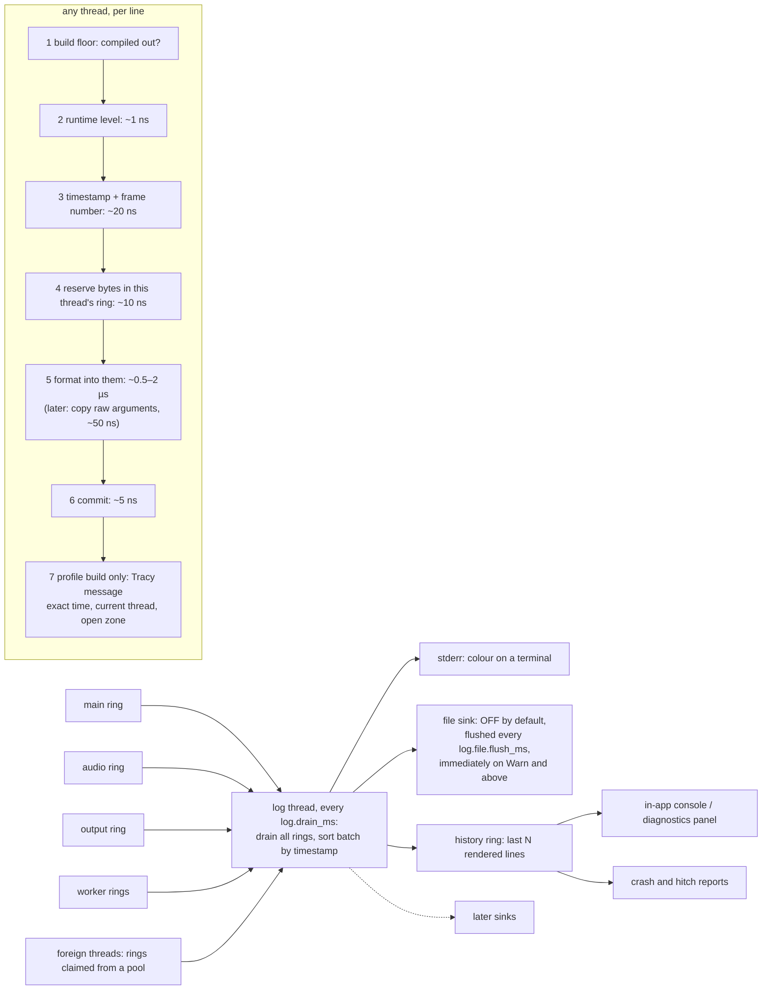

# eZeGo — Logging

> **Status:** Accepted and implemented, 2026-10-08 (`src/ez/log/`, first implementation: formatting at the call site). How-to in [`../docs/logging.md`](../docs/logging.md). The prototype logger was removed on 2026-10-08. §13 records what the implementation settled. Decision IDs (`LG-n`) are indexed in [`README.md`](./README.md).
> **Companions:** [`cvars.md`](./cvars.md) (every setting below is a cvar) · [`observability.md`](./observability.md) (metrics, Tracy, flight recorder, crash reports) · [`threading-and-timing.md`](./threading-and-timing.md) §7 (ring buffers) · [`linking.md`](./linking.md) L-5, L-6 · [`plugins.md`](./plugins.md) §6 · [`build-system.md`](./build-system.md) B-3 · [`philosophy.md`](./philosophy.md) §2
> **Scope:** how first-party code and plugins emit log lines, what a line costs on the thread that emits it, where lines go, and how developers and users control them. Metrics and crash reporting appear here as consumers; runtime variables are designed in [`cvars.md`](./cvars.md) and only used here. Identifier names are tentative until the naming convention is confirmed (§12).

---

## 1. What a log line is for (LG-3)

A log line records an **event**: something happened once, and a human may want to read about it later. Anything that happens at a rate, per frame, per packet, per callback, is a **metric** ([`observability.md`](./observability.md) §2) and is never a log line. This single rule keeps logs readable and keeps their cost bounded.

### 1.1 Levels

Six levels, ascending severity. The numbers match the `EZ_LOG_LEVEL` floor that `cmake/modes.cmake` already emits (0 trace … 4 error); the prototype's reversed enum is corrected.

| Level | Audience | Meaning | Volume rule |
|---|---|---|---|
| **Fatal** (5) | User, developer | The process cannot continue. Routes to the crash reporter and never returns. | Once |
| **Error** (4) | User | An operation failed and the user would want to know: a project did not load, a device stopped answering. | Per event |
| **Warn** (3) | User | Degraded but working: a fallback was taken, a frame was late, a setting was ignored. | Per event, flood-guarded |
| **Info** (2) | User, support | Lifecycle milestones: startup, device connected, project loaded, plugin activated. | A few per second at most in steady state |
| **Debug** (1) | Developer | Event-level detail for one module. | Per event, never per frame |
| **Trace** (0) | Developer | Flow detail. **The only level allowed per frame.** | Unbounded, exists only in `debug` builds |

### 1.2 Build floor

The floor is a compile-time constant per mode. Below it a log macro expands to nothing: no code, no argument evaluation. Above it, every line is still subject to the runtime level of its category (§3).

| Mode | Floor (`EZ_LOG_LEVEL`) | Runtime default |
|---|---|---|
| `debug` | Trace | Trace |
| `profile` | Info | Info |
| `release` | **Info** | **Info** |

**Decided by Amir, 2026-10-08.** The release floor was Warn in the B-3 table and in observability §6; both are corrected to Info. Lifecycle lines are therefore present in every build: in the history ring, in crash reports, and in the file when the user enables it, with no special build and no runtime switch. The cost is bounded by the volume rule of §1.1: Info is a few lines per second at most, about a microsecond each, plus the Info format strings in the shipped binary. `EZ_LOG=all:debug` has no effect in release, because Debug and Trace do not exist there.

### 1.3 What is never logged

- Anything per frame above Trace.
- Secrets, credentials, device keys.
- The contents of a user's project. The project's name and path are allowed.
- Anything that is a rate. Record a metric and, if a human should look, log one Warn line that names the metric.

---

## 2. The API (LG-1, LG-2)

### 2.1 Surface

```cpp
// ez/base/log.hpp : everything a caller sees. Sketch, names tentative.

EZ_LOG_TRACE(category, "format literal", args...)     // one macro per level; this is the whole API
EZ_LOG_DEBUG(category, ...)
EZ_LOG_INFO (category, ...)
EZ_LOG_WARN (category, ...)
EZ_LOG_ERROR(category, ...)
EZ_LOG_FATAL(category, ...)                           // synchronous, never returns (§8)

EZ_LOG_WARN_ONCE(category, ...)                       // flood guards: first hit at this call site only,
EZ_LOG_WARN_EVERY(n, category, ...)                   // or every n-th hit. Exist for every level.

EZ_LOG_RT(category, Level, "literal", u64)            // realtime-thread variant: no formatting (§4.6)
```

A category is a bare enumerator from the central table (§3): `EZ_LOG_INFO(artnet, "listening on %u", port)`. The format string is printf-style. Zero-argument lines work (`__VA_OPT__`, C++20).

### 2.2 How the macro expands, and why it is a macro over a template

```cpp
#define EZ_LOG_INFO(cat, fmt, ...)                                                        \
    do {                                                                                  \
        if constexpr (EZ_LOG_LEVEL <= 2)                            /* build floor      */ \
            if (::ez::log::enabled(::ez::log::Cat::cat, ::ez::log::Level::Info))          \
                ::ez::log::emit<::ez::log::Level::Info>(::ez::log::Cat::cat,              \
                    {__FILE__, __LINE__}, "" fmt "" __VA_OPT__(,) __VA_ARGS__);           \
    } while (0)

namespace ez::log {
    bool enabled(Cat, Level);                                   // one relaxed load, one compare
    template <Level L, class... Args>
    void emit(Cat, Src, const char* fmt, Args... args);         // the implementation seam (§4.5)
}
```

The arguments reach `emit` as a **template parameter pack**, so their types are known at compile time. That is the single property that lets the implementation change later: today `emit` hands the pack to `vsnprintf`; later it can copy the pack raw into the ring and format on the log thread (§4.5). With C varargs (`...`) the types would be lost and deferred formatting would be impossible.

| Cost of the template | Measure |
|---|---|
| Header weight | `<cstdint>`, `<type_traits>`; nothing from `<string>`, `<format>` or `<iostream>` |
| Instantiations | One per distinct (level, argument types) combination, not per call site; small functions |
| Compile-time format check | A dummy declaration carrying Clang's `format(printf)` attribute is called in a never-taken branch, so `-Wformat` validates every line and the optimizer deletes the call |

### 2.3 Caller rules, enforced at compile time

These are what make the later implementation possible. They cost nothing today.

| Rule | Why | Enforcement |
|---|---|---|
| 1. The format string is a string literal | The record stores a pointer to it; a literal lives forever | `"" fmt ""` concatenation fails to compile for anything else |
| 2. Arguments are integers, floats, bools, enums, pointers or C strings. `std::string` and other objects do not compile; pass `.c_str()`. | Raw copies must be trivially copyable; a C string is **copied at the call** because its memory may not outlive the line | `static_assert` on a `loggable<T>` trait |
| 3. Arguments are evaluated exactly once, and only when the line is enabled | Side effects inside a log call must not depend on the level | Follows from the expansion in §2.2 |
| 4. A line longer than `log.max_line` is truncated and ends with `…` | Fixed-size records | Implementation |

### 2.4 Why printf-style and not brace-style

| | printf `%u` | brace `{}` (`std::format` or fmt) |
|---|---|---|
| Type safety | Via the format attribute: compile error on mismatch | Native |
| Compile time | Negligible | `<format>` is one of the heaviest standard headers; it would be in every file |
| Allocation | None for our argument set with `vsnprintf` into a fixed buffer | `format_to_n` avoids it; `format` does not |
| Plugins | The same dialect crosses the C ABI unchanged | A second dialect for C plugins |
| Custom types | Not supported; format a handle as `%u` yourself | Supported |

**Decision: printf-style.** Philosophy §2.2 asks what every feature costs at compile time and at run time; brace-style buys custom-type formatting that a data-oriented codebase of handles and PODs rarely needs.

---

## 3. Categories (LG-4)

One category per module. Categories are a **closed, compile-time table** for first-party code and an **open runtime range** for plugins.

```cpp
// ez/base/log_categories.hpp : the central table. Adding a module means adding one line here.
#define EZ_LOG_CATEGORIES(X)                     \
    X(core,     "core")       X(memory,  "core.memory")  X(platform, "platform")   \
    X(thread,   "core.thread") X(fs,     "core.fs")      X(engine,   "engine")     \
    X(state,    "engine.state") X(timebase, "engine.time") X(audio,  "audio")      \
    X(net,      "net")        X(artnet,  "net.artnet")   X(sacn,     "net.sacn")   \
    X(midi,     "midi")       X(hw,      "hw")           X(render,   "render")     \
    X(ui,       "ui")         X(app,     "app")          X(plugin,   "plugin")
// Starter list; edited as modules are designed.

enum class Cat : u8 { /* generated */ core, memory, …, count,
                      plugin_first = 64, plugin_last = 127 };     // filled at plugin load
```

| Aspect | Decision |
|---|---|
| Storage | `levels[128]`, one byte per category, on its own cache line. Recording reads one byte with a relaxed load. |
| Names | Dotted, `parent.child`. The dot is a convention for prefix matching, not a hierarchy in code. |
| Runtime control | A level per category. The word `all` sets every category; a name sets the exact category and every category whose name starts with `name.`. Later settings override earlier ones, so `all:debug,net:trace` means "everything at debug, then `net` and `net.*` at trace". |
| Plugins | Each loaded plugin is assigned a slot in the runtime range and the name `plugin.<id>`, so `EZ_LOG=plugin.myfx:debug` works like any other category ([`plugins.md`](./plugins.md) §5). |
| Floor | A runtime level can never go below the build floor (§1.2): the code for those lines does not exist. |

**Why a central table and not a declaration in each module.** The "all" control and the diagnostics panel need to enumerate categories. A central table gives the enum, the name table and the level array with zero registration logic, which also satisfies L-6 (no static-initializer registration). The cost is that adding a category touches one shared header, the same trade-off as the explicit source lists in B-9.

---

## 4. The pipeline (LG-5, LG-6, LG-8)

### 4.1 Mechanics

A log call is three steps, and the design question is which thread pays for each.

1. **Decide**: compile-time floor, then the category's runtime level.
2. **Format**: turn the arguments into text.
3. **Emit**: write the text to the sinks (console, file, memory, Tracy).

| Where steps 2 and 3 happen | Caller cost per line | Fit for eZeGo |
|---|---|---|
| Both on the caller, synchronous | Microseconds, plus a file write that can stall for milliseconds | No. A file write on the frame thread is a hitch (philosophy §3.4); on the audio thread it is a dropout. |
| Format on the caller, emit on a log thread | ~0.5–2 µs, zero I/O | **First implementation** |
| Copy raw arguments on the caller, format and emit on the log thread | ~50 ns | **Later**, behind the same API (§4.5) |

### 4.2 Decision

Every thread that logs owns a **single-producer, single-consumer byte ring**, preallocated at init. A line is reserved, written and committed into the calling thread's ring. One **low-priority log thread** drains every ring periodically, sorts the batch by timestamp, and feeds the sinks. Nothing on a calling thread allocates, locks or performs I/O.



| Element | Decision | Reason |
|---|---|---|
| One ring per thread | SPSC, wait-free for the producer, no CAS | The audio thread's "zero alloc, zero lock" rule ([`threading-and-timing.md`](./threading-and-timing.md) §2); no false sharing between producers |
| Byte ring with variable-length records | A header plus a payload, a `Skip` record at the wrap | A fixed slot wastes most of itself on a 60-byte line; `log.max_line` becomes a runtime setting; the later implementation needs variable-length argument packs anyway |
| Preallocated pool | `log.threads_max` rings of `log.ring_kib` each, allocated once at init under memory tag `core/log` | No allocation after init, in any build |
| Thread registration | A thread created through the thread system gets a ring at creation. A **foreign thread** (an audio driver's callback thread, a MIDI library's input thread) claims a ring from the pool on its first line with one atomic exchange. | Covers threads we did not create without a second queue type |
| Ring full | The line is dropped and a per-thread dropped counter increments (a metric). The log thread emits one `N lines dropped on thread X` line when it notices. | Never block, never allocate; losing a debug line is better than a hitch |
| Pool exhausted | Same as ring full | |
| Drain | Periodic, `log.drain_ms` (default 20). Producers never signal the log thread, because a wake is a syscall and the audio thread may not make one. | Simplicity and RT safety over a few milliseconds of latency |
| Ordering | Exact within one thread. Across threads, each drained batch is sorted by timestamp, so the output is in true temporal order. | |
| Priority | The log thread runs at low priority. | It must never compete with the frame or audio threads |

### 4.3 The record (LG-8)

The record is the contract between the producer, the log thread, the diagnostics panel and the crash reporter. Its fields are fixed now; its encoding is not.

```cpp
struct RecordHeader {                 // 32 bytes, followed by the payload
    u32         size;                 // header + payload; lets the drain skip records
    u8          level, category, thread, kind;   // kind: Text | Rt | Skip
    u64         ticks;                // reference clock, raw ticks (threading-and-timing.md §5)
    u32         frame;                // engine frame counter at emit time
    u32         line;                 // __LINE__
    const char* file;                 // __FILE__ literal: static storage, stored by pointer
};
// Text payload (first implementation): the formatted bytes, no terminator.
// Rt   payload: pointer to the literal + one u64.
// Text payload (later implementation): a pointer to a per-call-site descriptor plus packed arguments.
```

**Timestamp and frame.** The timestamp is the same reference clock the metrics use, so a log line and a hitch line up. The frame number lets the diagnostics panel show "this line fell inside frame 1234, which took 23 ms" and lets a hitch report pick the lines of its frame.

### 4.4 Tracy correlation

In `profile` builds, step 7 emits the formatted line as a Tracy message **on the calling thread, at the call site**. Tracy stamps it with that instant and attaches it to the zone that is open, so log lines appear inside the right frame and the right zone on the timeline ([`observability.md`](./observability.md) §3). Colour by level.

When deferred formatting lands, **profile builds keep formatting at the call site.** Tracy's message API has no "emit with this timestamp" call, so a message sent from the log thread would carry the wrong time. A microsecond per enabled line is affordable in a build whose job is to measure.

### 4.5 First implementation, and the swap (LG-6)

The first implementation formats at the call site: `emit` reserves `log.max_line` bytes in the ring, runs `vsnprintf` into them, and commits the actual length. It uses only machinery that is known to work, every line is text in the ring, and the crash reporter can dump rings as they are.

The later implementation copies the argument pack raw and formats on the log thread. The macro surface, the caller rules and the record fields are what make that swap invisible to callers.

| Fixed now | Free to change later |
|---|---|
| Macro names and arguments, the four caller rules (§2.3), the RT variant | Whether step 5 formats or copies raw arguments |
| Record fields (§4.3), including frame and ticks | Record encoding, ring layout, pool strategy |
| Sink behaviour (§5), cvar names and syntax (§6) | How the log thread renders a record, the sort strategy, wake strategy |
| No allocation after init; drop-and-count; no I/O on a caller; per-thread order; per-batch timestamp order | Where the console prefix is built |

**One trade-off to carry into the swap.** With text in the ring, the crash reporter dumps rings from inside a signal handler with no further work. With raw arguments in the ring, the crash path must either format in the handler, which is not formally signal-safe, or write the raw records and let the offline symbolize tool render them. The second is the right answer, so the swap touches the crash reporter as well as the logger. The trigger for the swap is a measurement showing call-site formatting on the frame thread matters (philosophy §3), not a date.

### 4.6 The realtime variant

`EZ_LOG_RT(category, Level, "literal", value)` writes a 48-byte record with the literal's pointer and one `u64`, about 30 ns, and no formatting at all. The log thread renders it as `literal = value`. It is wait-free and clean under the realtime sanitizer preset (B-3). It is the rule on the audio thread; the formatting macros compile there too, but about a microsecond of `vsnprintf` on a realtime thread is exactly what the `rtsan` preset exists to catch.

---

## 5. Sinks (LG-7)

| Sink | Default | Behaviour |
|---|---|---|
| **stderr** | On | Every drained line. Colour by level when stderr is a terminal and `NO_COLOR` is unset; plain otherwise. **Never stdout:** stdout belongs to the headless runner's data output, so `ezego-headless … > metrics.json` stays clean. |
| **File** | **Off** | One file per session, `ezego-YYYYMMDD-HHMMSS.log`, in the OS state directory (Linux `$XDG_STATE_HOME/ezego/logs`, macOS `~/Library/Logs/eZeGo`, Windows `%LOCALAPPDATA%\eZeGo\logs`); the last `log.file.keep` sessions are kept. Written through a preallocated 64 KiB buffer, flushed every `log.file.flush_ms` and **immediately after any batch containing Warn or above**. The first line is a session header: wall-clock start, version, commit, mode, OS. |
| **History ring** | On | The last `log.history_kib` of rendered lines in memory. Read by the in-app console and diagnostics panel, attached to crash reports (observability §2.3) and hitch reports. |
| **Tracy** | `profile` builds | At the call site, §4.4. |
| **Debugger console** | Auto | Windows: `OutputDebugString` when a debugger is attached and no console exists. |
| **Later** | | Other sinks plug into the drain; nothing else changes. |

**Synchronous mode for debugging.** When a breakpoint hits, the last `log.drain_ms` of lines have not been printed yet. `log.sync` (`auto` | `on` | `off`, default `auto` = on when a debugger is attached at init) makes the call site also write the rendered line to stderr immediately after committing it. Cost: one `write` syscall per line on the caller, about 2–5 µs, which is why it is off unless a debugger is present. The RT variant is exempt: it never writes synchronously.

**Windows console.** A GUI-subsystem executable has no console. When launched from a terminal the app attaches to the parent console so stderr is visible; otherwise the file and history sinks are the way to read logs. Virtual-terminal processing is enabled for colour.

**Line format** (console and file; the record itself is binary):

```text
12:34:56.789  W  net.artnet   output   frame late by 2.31 ms                 <artnet.cpp:88>
hh:mm:ss.mmm  L  category     thread   message                               <file:line>
```

---

## 6. Sizes and runtime control (LG-9, LG-10)

### 6.1 Sizes

| Setting | Where | Default | Notes |
|---|---|---|---|
| `EZ_LOG_MAX_LINE` | Build time | 4096 | Hard cap on a line; sizes the reserve in the ring |
| `EZ_LOG_LEVEL` | Build time, from the mode | §1.2 | The floor |
| `log.max_line` | Runtime | 512 | May be raised up to the build cap; 1024 and 2048 are the expected alternatives |
| `log.ring_kib` | Runtime, read at init | 128 | Per thread. Sizing arithmetic: a debug build tracing 200 lines of 120 bytes per frame at 120 Hz produces about 24 KiB per frame; a 20 ms drain spans 2.4 frames, so 128 KiB leaves headroom for a slow drain. |
| `log.threads_max` | Runtime, read at init | 16 | Size of the ring pool |
| `log.history_kib` | Runtime, read at init | 256 | About two thousand rendered lines |
| `log.drain_ms` | Runtime | 20 | Log thread period |
| `log.file` | Runtime | off | File sink |
| `log.file.flush_ms` | Runtime | 1000 | Periodic flush; Warn and above flush at once |
| `log.file.keep` | Runtime | 10 | Sessions kept |
| `log.sync` | Runtime, read at init | auto | §5 |
| `log.level.<category>` | Runtime, live | floor-dependent | One per category, plus `log.level.all` |

Settings read at init are fixed for the session because they size preallocated memory. Levels change live.

### 6.2 Four doors, one mechanism (LG-10)

Every setting above is a runtime variable (cvar) and can be set from four places. Later sources override earlier ones.

```text
defaults  <  settings file  <  environment  <  command line  <  in-app console

EZ_LOG=all:debug,net:trace ./ezego          # environment: everything at debug, then net.* at trace
./ezego --log=all:warn --log-file=on        # command line overrides the environment
log.level net.artnet trace                  # in-app console or diagnostics panel, live
log.file on                                 # persisted only if the user saves settings
```

`EZ_LOG` and `--log` are curated shorthands for the `log.level.*` variables, with the `all` keyword and prefix matching of §3; they expand into ordinary cvar sets ([`cvars.md`](./cvars.md) §6.2). Every setting in §6.1 is a cvar: the ones marked "read at init" are `Startup`, the levels and `log.file` are `Live`. The registry initialises before the logger and buffers its own startup messages until the logger is up ([`cvars.md`](./cvars.md) §13).

---

## 7. Cost and latency per line

| Situation | Cost on the calling thread | When the line is visible |
|---|---|---|
| Below the build floor | 0; the arguments are not evaluated | Never |
| Filtered by the runtime level | ~1 ns: one relaxed load, one compare, a predictable branch | Never |
| Enabled, first implementation | ~0.5–2 µs: timestamp ~20 ns, reserve ~10 ns, `vsnprintf` 0.3–1.5 µs depending on argument count and floats, commit ~5 ns | stderr and file within `log.drain_ms`; history ring on the same drain; Tracy immediately |
| Enabled, later implementation | ~50 ns: timestamp plus a raw copy of the arguments | Same |
| RT variant | ~30 ns | Same |
| Flood-guarded, suppressed hit | ~1 ns: one counter increment and a compare | Never |
| `log.sync` on | Above plus one `write` syscall, ~2–5 µs | stderr immediately |
| Fatal | Synchronous | Immediately |
| Ring full or pool exhausted | ~10 ns; dropped and counted | A summary line from the log thread |

Heap allocations on any of these paths: **0**. The rings, the pool, the file buffer and the history ring are allocated once in `log::init`. `vsnprintf` with our argument set does not allocate; the `rtsan` preset verifies it for the RT thread, and an allocation inside the logger in any build is a bug.

Each number above is a starting hypothesis in the sense of philosophy §3.6; the logger measures its own cost as one of its metrics.

---

## 8. Fatal, shutdown and crashes (LG-11)

- **Fatal is synchronous.** `EZ_LOG_FATAL` formats on the caller, writes stderr immediately, hands the text and every ring's undrained records to the crash reporter, which writes the report with the history ring and the flight recorder attached, then traps. It never returns. Assertion failures and the terminate handler take the same path, so there is one report format.
- **A crash reads the rings directly.** The log thread may be mid-write when a fault arrives, so the crash reporter does not depend on it: it copies the history ring and each thread's undrained ring as they are. Rings and the history ring live in static or init-time storage so this needs no allocation inside the handler.
- **Shutdown** stops producers, drains every ring once more, flushes and closes the file, then releases the pool. The logger shuts down after everything that logs and before the profiler and the memory system, the reverse of the start order in observability §3.
- **Start order.** Memory, then profiler, then logger, then everything else. The logger needs the memory system for its rings, and the log thread names itself with Tracy, which requires the profiler to be running first (found by the experiment, observability §3).

---

## 9. Plugins (LG-12)

Plugins log through the host table ([`plugins.md`](./plugins.md) §6), printf-style across the C ABI:

```c
host->log(ctx, EZ_LOG_LEVEL_WARN, "fixture %u not responding", id);
```

The host receives the `va_list`, formats it with `vsnprintf` into the calling thread's ring under the plugin's category `plugin.<id>`, and from there the line is indistinguishable from a first-party one: same sinks, same runtime control, same crash-report capture. Cost on the plugin's thread is the same microsecond as a first-party line. The plugin category is assigned at load in the runtime range of §3; the diagnostics panel can filter by it, which makes a noisy plugin attributable.

---

## 10. Usage

The samples show what each line costs on the thread that emits it and when it becomes visible. They are the intended reading of the API, not final code.

```cpp
// ===== src/ez/net/artnet.cpp : an ordinary module =============================
#include "ez/base/log.hpp"

Status artnet_open(ArtnetNode& node, u16 port)
{
    EZ_LOG_TRACE(artnet, "artnet_open port=%u", port);
    // Compiled out in profile and release: zero bytes of code.
    // In debug: ~1 ns to compare against the runtime level of "net.artnet".
    // If enabled: ~0.5 µs on this thread to format one integer. Nothing allocates.

    Status st = udp_bind(node.socket, port);
    if (st.failed()) {
        EZ_LOG_ERROR(artnet, "bind to port %u failed: %s", port, status_text(st));
        // Always compiled in. About 1 µs on this thread: timestamp ~20 ns, reserve ~10 ns,
        // vsnprintf ~0.5–1 µs, commit ~5 ns. The C string is copied during formatting.
        // Visible on stderr and in the in-app console within log.drain_ms (20 ms default).
        // Profile build: also a Tracy message at this exact timestamp, inside the open zone.
        return st;
    }

    EZ_LOG_INFO(artnet, "listening on %u, universes %u..%u", port, node.first_u, node.last_u);
    // Lifecycle milestone, once per open, so Info is the right level. Same cost as above.
    return Status::ok();
}

void artnet_send(ArtnetNode& node, const DmxFrame& f)     // output thread, ~44 Hz
{
    if (f.late_ns > node.late_threshold_ns) {
        EZ_LOG_WARN_EVERY(100, artnet, "frame late by %.2f ms", ns_to_ms(f.late_ns));
        // Per-call-site counter: 99 of 100 hits cost one increment and a compare, ~1 ns.
        // The lateness rate itself is a metric; this line only points a human at it.
    }
}
```

```cpp
// ===== src/ez/audio/callback.cpp : the realtime thread ========================
void audio_callback(AudioCtx& ctx, f32* out, u32 frames)
{
    if (ctx.frames_missed) {
        EZ_LOG_RT(audio, Warn, "dropout, frames missed", ctx.frames_missed);
        // No formatting: a 48-byte record is copied into the audio thread's ring, ~30 ns,
        // wait-free, clean under the realtime sanitizer. Rendered by the log thread as
        // "dropout, frames missed = 128".
    }
}
```

```cpp
// ===== src/ez/engine/loop.cpp : hot loop and a fatal path =====================
EZ_LOG_TRACE(engine, "frame %u begin", frame_no);
// Trace is the only level permitted per frame. It does not exist in profile or release.

if (!project_load(path)) {
    EZ_LOG_FATAL(core, "project '%s' failed to load, cannot continue", path);
    // Synchronous, the process is dying: formats, writes stderr immediately, hands the text
    // and every ring's undrained lines to the crash reporter, which writes the report
    // with the flight recorder attached, then traps. Never returns.
}
```

```c
/* ===== a plugin, in C, any compiler ========================================== */
host->log(ctx, EZ_LOG_LEVEL_WARN, "fixture %u not responding", id);
/* printf-style across the C ABI. The host formats it under this plugin's own category
   "plugin.<id>", same ring, same sinks, ~1 µs on whichever thread the hook runs on. */
```

```cpp
// ===== main.cpp : startup ======================================================
ez::log::init(log_config());
// Allocates every ring, the pool, the file buffer and the history ring once, under memory
// tag core/log, and starts the log thread. After this call no log path allocates, ever.
// Threads created through the thread system get a ring at creation. A foreign thread,
// like an audio driver's callback thread, claims one from the pool on its first line with
// one atomic exchange. Pool exhausted: the line is dropped and counted.
```

---

## 11. What this depends on

The logger is in Layer 0 and is among the first things initialised, so most of its dependencies are foundations that are not designed yet. The first implementation can stub each one and is corrected when the real design lands.

| Needs | From | Stub for the first implementation |
|---|---|---|
| Raw ticks and a wall-clock anchor | Reference clock ([`README.md`](./README.md) next topic 2) | `clock_gettime` / `mach_absolute_time` / `QueryPerformanceCounter` directly |
| Thread creation that registers a ring and names the thread | Thread system (not yet designed) | Manual `log::register_thread(name)` at the top of each thread function |
| Init-time allocation under a tag | Memory system (next topic 1) | A plain aligned allocation with the tag recorded as a string |
| The OS state directory for the file sink | Filesystem and paths module (not yet designed) | Platform-specific lookup inside the file sink |
| Settings, environment and command-line parsing | Cvar registry ([`cvars.md`](./cvars.md), proposed alongside) | If the registry lands later: a POD config struct filled by a 40-line parser in the logger |
| The frame counter | Engine loop | A global `u32` incremented by the loop; zero before the loop starts |
| The fatal path and ring capture at crash | Crash reporter (not yet designed) | Fatal writes stderr and calls `abort()` |
| The in-app console and diagnostics panel | UI system ([`ui-system.md`](./ui-system.md)) | None; the history ring exists regardless |
| Dropped-line and self-cost counters | Metrics registry (observability §2) | Plain atomics printed by the log thread on shutdown |

---

## 12. Open questions

### 12.1 To clarify before implementation starts

Nothing: the naming convention was accepted on 2026-10-08 ([`naming.md`](./naming.md)).

Nothing else blocks accepting the design. Everything below has a stated default and can be revisited from use.

### 12.2 Deferred

| Topic | Default | Revisit when |
|---|---|---|
| Console timestamp: wall-clock `hh:mm:ss.mmm` or seconds since start | Wall-clock; the record keeps raw ticks so either can be rendered | First real use |
| Session files kept (`log.file.keep`) and naming | 10, `ezego-YYYYMMDD-HHMMSS.log` | Packaging |
| Should the headless runner enable the file sink by default? | Off, like the app; CI passes `--log-file=on` | Headless runner design |
| `string_view` arguments: a helper that expands to `%.*s` with length and pointer | Not provided; C strings only | If `string_view` becomes common in first-party code |
| Should Error lines surface as user notifications in the UI? | The UI reads the history ring by level; no flag in the record | UI design (U-8) |
| Ring, pool and history sizes | §6.1 | Measured in debug builds under trace load |
| Log thread wake: periodic only, or also signalled by non-RT producers for lower latency | Periodic | If 20 ms latency is ever a problem |
| Structured file format (JSON lines) next to the text file, for tooling | Text only | When a tool needs to ingest logs |
| The deferred-formatting swap (§4.5) | First implementation | A measurement shows call-site formatting on the frame thread matters |
| `-Werror=format` locally, or only in the `check` preset | Only in `check` and CI, like other warnings | Warnings policy in the foundations document |
| Trace lines in `profile` builds for a one-off investigation | Not available; `profile` floor is Info | A personal preset could set `EZ_LOG_LEVEL=0` on `profile` if ever needed |

---

## 13. Implementation notes (2026-10-08)

### 13.1 Measured costs

`ez bench`, release tree, AMD Ryzen Threadripper 3970X, Linux, Clang 18. Median per operation on the
calling thread; the logger running with a 16 MiB ring, a 1 ms drain and stderr off.

| Operation | Measured | §7 estimate |
|---|---|---|
| Filtered line (category below its runtime level) | 1.9 ns | ~1 ns |
| Enabled line, one integer | 99–190 ns | 0.5–2 µs |
| Enabled line, integer + float + string | 420 ns | 0.5–2 µs |
| Realtime variant | 69 ns | ~30 ns |
| Flood-guarded hit, suppressed | 4.9 ns (an atomic increment) | ~1 ns |

The call-site formatting the first implementation uses is cheaper than estimated, which lowers the
pressure for the deferred-formatting swap of §4.5. The realtime variant and the flood guard cost
more than estimated; both are bounded and lock-free.

### 13.2 What the implementation settled

| Topic | As implemented |
|---|---|
| Categories | One per module, generated from `modules.cmake`; sub-categories such as `net.artnet` arrive with sub-modules. The plugin range 64..127 is reserved, without an API yet. |
| Level cvars | `log.level.all` plus one `log.level.<module>` per module, generated; a module's level defaults to `inherit`. `off` silences everything but Fatal. |
| Extra cvar | `log.stderr` (developer tier): switches the console sink off, for benchmarks and tools that own stderr. |
| Pool | Rings are claimed on a thread's first line or by `register_thread`; a thread's ring is returned to the pool once it has exited and been drained. |
| Not running | Before `init()` and after `shutdown()`, lines are rendered and written to stderr on the caller. |
| Exit without shutdown | The log thread is stopped and what is queued is written; nothing else is touched. |
| Seams | `set_profiler_hook` (called at the call site), `set_fatal_hook`, `add_sink`, `read_history`. Nothing includes Tracy; the profiler backend installs the hook. |
| Fatal | Drains every ring, writes its own line to every sink, flushes, calls the fatal hook, then `abort()`. |
| cvars messages | The logger installs itself as the cvars report receiver, so startup warnings and every cvar change appear as `cvars` lines. |
| Line ending | A cut line ends with `...` (ASCII) rather than `…`. |
| Assertions | While the logger runs it is the base assert handler: a failed assertion is written after every pending line, on every sink, before the debugger break. |
| Not yet done | Plugin categories and the plugin `host->log`; the Windows paths are written but not yet compiled. |
