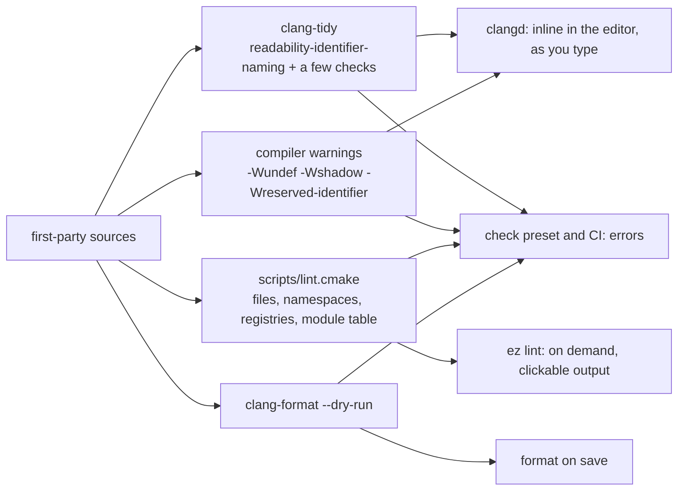

# eZeGo — Naming and Namespaces

> **Status:** Accepted, 2026-10-08, with the defaults of §15.1. **Enforced** from 2026-10-08: `.clang-tidy`, `scripts/lint.cmake`, the `check` preset; how-to in [`../docs/lint.md`](../docs/lint.md). Decision IDs (`N-n`) are indexed in [`README.md`](./README.md).
> **Companions:** [`build-system.md`](./build-system.md) B-9, B-12, B-13, B-14 · [`linking.md`](./linking.md) L-6 · [`plugins.md`](./plugins.md) §2 · [`logging.md`](./logging.md) §3 · [`cvars.md`](./cvars.md) §7 · [`philosophy.md`](./philosophy.md) §2
> **Scope:** the names of everything in the repository: namespaces, types, functions, variables, macros, files, build targets, registry names (cvars, log categories, metrics, memory tags), and the C SDK; and how each rule is detected and enforced. Layout and formatting belong to `clang-format` and appear only where they touch naming.

---

## 1. Principles

1. **Consistency over taste.** A rule is kept because it is the same everywhere, not because it is the nicest. Where two options are equally good, the one that is cheaper to enforce wins.
2. **The shape tells the kind.** A reader should know from the spelling alone whether a name is a type, a function or variable, or a macro, and from a prefix or suffix whether it is global state, private state, or a setting. No lookup needed.
3. **Three shapes, total** (§2). Every other rule is a prefix, a suffix or a vocabulary rule on top of them.
4. **One module name, everywhere** (§3.3). A module is spelled the same way in its directory, its namespace, its build target, its log category, its cvar prefix and its memory tag.
5. **A rule that tooling cannot detect is a guideline, not a rule.** Rules are enforced by `clang-tidy`, compiler warnings or the lint script (§13). Guidelines are marked as such and are a review matter.
6. **Our own convention, not someone else's.** Where it coincides with the standard library or Google's style that is because the same reasoning applies, not because we follow them.

---

## 2. The three shapes (N-1)

| Shape | Used for | Examples |
|---|---|---|
| `lower_snake_case` | Everything that is not a type or a macro: namespaces, functions, methods, variables, parameters, members, constants, files, directories, build targets, registry names | `apply_pending`, `late_ns`, `ez::net`, `ring_buffer.hpp`, `log.drain_ms` |
| `PascalCase` | Every type: classes, structs, enums, enumerators, type aliases, concepts, template parameters | `LogRecord`, `Level::Warn`, `Handle<FixtureTag>`, `T` |
| `UPPER_SNAKE_CASE` | Macros, and constants in the C SDK | `EZ_LOG_INFO`, `EZ_ASSERTS`, `EZ_LOG_LEVEL_WARN` |

The lowercase shape covers constants on purpose. A fourth shape for constants would buy little, since a constant is used like a variable, and would cost a rule, a check and an exception list. The standard library makes the same choice.

**Why functions are `lower_snake_case` and not `camelCase` as in the prototype.** The C SDK must be `ez_snake_case`; C has no namespaces and that is its universal convention. With snake case in C++ too, `ez::plugin::register_plugin` and `ez_plugin_register` are the same words in two dialects (§10), first-party calls read uniformly next to `std::` and C library calls, and functions, variables and files share one shape. The prototype's `platformAllocateMemory` also carried the module name inside the identifier as a substitute for a namespace; with namespaces that prefix is dropped: `ez::platform::allocate`.

---

## 3. Namespaces (N-2, N-3)

### 3.1 Structure

```text
ez                      root; holds the base module itself: src/ez/base/ maps to ez, not ez::base
                        (code-organization.md CO-9): primitive types, handles, result, containers
ez::<module>            one per module directory under src/ez/, L0 to L2: ez::log, ez::cvars, ez::mem,
                        ez::platform, ez::engine, ez::audio, ez::net, ez::ui, ez::app ...
ez::<module>::<sub>     only when src/ez/<module>/<sub>/ exists: ez::net::artnet
ez::<module>::detail    implementation that must be in a header but is not API
(anonymous)             file-local, in .cpp files only
```

| Rule | Decision | Enforced by |
|---|---|---|
| Namespace path equals directory path | `namespace ez::net::artnet` may appear only in files under `src/ez/net/artnet/`. One exception: `src/ez/base/` is namespace `ez` ([`code-organization.md`](./code-organization.md) CO-9). | lint script |
| Depth | At most three segments below `ez`, which is `module::sub::detail` | lint script |
| `detail` is private | `ez::<m>::detail` is referenced only from files of module `m` | lint script |
| No `using namespace` | Anywhere in first-party code, including `.cpp` files. Code lives inside its own namespace block and names siblings unqualified. Tests may use `using namespace` (`tests/.clang-tidy`). | `clang-tidy google-build-using-namespace` |
| No namespace aliases in headers | | `clang-tidy` |
| Anonymous namespaces | Only in `.cpp`. In headers, use `detail`. | `clang-tidy misc-anonymous-namespace-in-header`, lint script |
| Names | Lowercase, one word, short: `net`, `mem`, `log`, `ui`, `hw`. Abbreviations from §12. | `clang-tidy NamespaceCase` |

### 3.2 What namespaces do and do not do

Namespaces organise names and make the module structure visible at every call site: `log::emit`, `cvars::set`, `platform::clock::now`. They do **not** enforce the layer rule; the build graph does ([`build-system.md`](./build-system.md) B-9). A namespace is a reading aid and a grouping, never a security boundary.

### 3.3 One module name, six places

The **central module table**, to be defined in the base-layer document, is the single list of module names. Every other place derives from it or is checked against it.

| Place | Spelling for module `net` |
|---|---|
| Directory | `src/ez/net/` |
| Namespace | `ez::net` |
| Build target and alias | `ez_net`, `ez::net` |
| Log category ([`logging.md`](./logging.md) §3) | `net`, `net.artnet` |
| Cvar prefix ([`cvars.md`](./cvars.md) §7) | `net.*` |
| Memory tag ([`observability.md`](./observability.md) §4) | `net`, `net.artnet` |

The lint script checks that a directory, a namespace and a target exist for every table entry and that nothing else does.

---

## 4. Types (N-4)

| Kind | Rule | Example |
|---|---|---|
| Classes, structs, unions, enums, type aliases, concepts | `PascalCase` | `LogRecord`, `CVar<T>`, `Status` |
| Enumerators | `PascalCase`, no prefix repeating the enum, no `k` | `Level::Warn`, not `Level::LevelWarn` or `Level::kWarn` |
| Enums | Always `enum class` with an explicit underlying type. Singular name. A trailing `Count` sentinel is allowed. | `enum class Level : u8 { Trace, …, Fatal, Count };` |
| Template parameters | `PascalCase`; single capitals are fine | `T`, `Tag`, `N` |
| `struct` versus `class` | `struct` for data with public members; `class` when there are invariants and private members. Same naming. | |
| Acronyms | Written as words: only the first letter capitalised | `DmxFrame`, `GpuTimer`, `UiPanel`, not `DMXFrame` |

### 4.1 Primitive aliases, the one exception

The fixed-width aliases are spelled like built-in types because they are used like them: `u8 u16 u32 u64 i8 i16 i32 i64 f32 f64 b8 usize isize`. They live directly in `ez`. They are the only lowercase type names and are listed by name in the `clang-tidy` exception (§13). `i32` replaces the prototype's `s32`: `i` for integer is what Rust, Zig and most engines use, and `s` has no meaning outside this codebase (open question §15.1).

### 4.2 Role suffixes (guideline)

A suffix says what role a type plays. Use one when the role matters; do not invent new ones casually.

| Suffix | Role | Example |
|---|---|---|
| `Handle` | Generational index into a pool | `FixtureHandle` |
| `Id` | Stable identifier, not an index | `PluginId` |
| `Tag` | Empty type that makes a strong type | `FixtureTag` |
| `Config` | Init-time POD passed to `init` | `LogConfig` |
| `Record`, `Header` | Serialized or ring-buffer layouts | `LogRecord` |
| `View` | Non-owning reference to data | `ChannelView` |
| `Api` | A C function table | `HostApi` |

No Hungarian notation, no `C`, `I`, `T` or `S` type prefixes.

---

## 5. Functions (N-5)

| Rule | Decision | Example |
|---|---|---|
| Shape | `lower_snake_case`, free functions and methods alike | `apply_pending()`, `send_frame()` |
| Actions are verbs | | `open`, `send_frame`, `register_thread` |
| Plain accessors are nouns, no `get_` | | `value()`, `size()`, `generation()` |
| Mutators are `set_` | | `set_level(cat, Level::Debug)` |
| Predicates are `is_`, `has_`, `can_` | Functions returning `bool` | `is_debugger_attached()`, `has_pending()` |
| No module name in the function name | The namespace carries it | `ez::platform::allocate`, not `platform_allocate` |
| Lifecycle pairs use fixed verbs | One pair per concept, never mixed | table below |

| Pair | For |
|---|---|
| `init` / `shutdown` | Modules and subsystems |
| `create` / `destroy` | Objects with a lifetime: threads, windows, pools. Never `make_`. |
| `open` / `close` | Resources: files, sockets, devices |
| `start` / `stop` | Threads, streams, the profiler |
| `begin` / `end` | Scopes and frames |
| `acquire` / `release` | Slots, locks, rings from a pool |
| `push` / `pop`, `read` / `write`, `load` / `save`, `register` / `unregister`, `enable` / `disable`, `attach` / `detach`, `lock` / `unlock` | As named |

Predicates and the verb pairs are guidelines in the sense of §1.5; the shape is a rule.

---

## 6. Variables (N-6)

| Kind | Rule | Example |
|---|---|---|
| Locals and parameters | `lower_snake_case` | `late_ns`, `port` |
| Public data members, struct fields | `lower_snake_case`, no decoration | `record.frame` |
| Private and protected members | Trailing underscore | `value_`, `generation_` |
| Mutable global state, including class statics and function statics | `g_` prefix | `g_registry` |
| `thread_local` | `t_` prefix | `t_log_ring` |
| Cvar objects | `cv_` prefix; they are globals, but the prefix says what kind | `cv_hw_watch.value()` |
| Constants: `constexpr`, `const` globals, class constants | `lower_snake_case`, no prefix | `max_line`, `cache_line` |
| Booleans | Variables and fields are states, no prefix: `locked`, `enabled`. Functions are predicates (§5). | |
| Quantities carry their unit as a suffix | `_ns`, `_ms`, `_hz`, `_bytes`, `_kib`, `_count`. Strong types like `Ticks` need no suffix. | `late_ns`, `ring_kib`, `fixture_count` |
| Counts and indices | `<thing>_count`, `<thing>_index`; loop indices `i`, `j` | not `num_fixtures`, not `n_fixtures` |
| Collections | Plural | `fixtures`, `rings` |

**Why a trailing underscore for private members and nothing for public ones.** Most of eZeGo's data is public POD, where `m_` on every field is noise. Where a class does hide state, the underscore marks it and keeps constructors free of `value = value` mistakes that `-Wshadow` does not catch for members. `clang-tidy` can enforce exactly this split.

**Why `g_`.** Mutable global state is rare by design (philosophy §2) and should be visible at every use. Cvars are the one sanctioned kind of global and get their own prefix so that "where is this setting read" is a `grep` for `cv_name`.

---

## 7. Macros and feature flags (N-7)

| Rule | Decision | Enforced by |
|---|---|---|
| Shape and prefix | `UPPER_SNAKE_CASE` with the `EZ_` prefix, always, including private helper macros (`EZ_DETAIL_…`) | `clang-tidy MacroDefinitionCase/Prefix` |
| Feature macros | `EZ_<FEATURE>`, always defined as `0` or `1` by the build; tested with `#if EZ_X`, never `#ifdef` | `-Wundef`, so a typo in `#if` is a warning instead of silently false |
| No leading underscores, ever | Identifiers beginning with `_` followed by a capital, or containing `__`, are reserved for the implementation. The prototype's `__FILENAME__` is replaced. | `-Wreserved-identifier`, `clang-tidy bugprone-reserved-identifier` |
| Macros only where a function cannot do the job | Source location, compile-time elimination, token pasting, the C SDK | Review |
| Function-like macros that are statements | Wrapped in `do { } while (0)` | Review |

---

## 8. Files and directories (N-8)

| Rule | Decision |
|---|---|
| Names | `lower_snake_case`, ASCII, no spaces |
| Extensions | `.hpp` for C++-only headers, `.h` for headers that must compile as C (the SDK, platform detection), `.cpp` for sources |
| Location | `src/ez/<module>/<topic>.hpp` and `.cpp`; one module per directory; submodules are subdirectories |
| Platform-specific sources | Suffix `_linux`, `_macos`, `_windows`, or `_posix` for code shared by Linux and macOS: `clock_linux.cpp`. The suffixes are the preset platform names, selected by CMake (B-9), never by `#ifdef` around a whole file. |
| Tests | `tests/<module>/<topic>_test.cpp`, mirroring `src/ez/`. Suffix, not prefix, so a test sorts next to its subject. |
| Include guards | `#pragma once` as the first non-comment line of every header |
| Include paths | First-party: `#include "ez/log/log.hpp"`, rooted at `src/`, never `../`. Tests may also include files under `tests/` rooted there: `"support/subprocess.hpp"`, `"cvars/fixtures.hpp"`. System and third-party: angle brackets. |
| Include order | Own header, first-party, third-party, system; blank line between groups. Requires `IncludeBlocks: Regroup` and categories in `.clang-format` (today it is `Preserve`). |
| Generated files | `*.gen.hpp`, only in build trees, never committed |

---

## 9. Registry names (N-9)

Cvars, log categories, metrics and memory tags are strings that users and support staff read. One grammar for all four:

| Rule | Decision |
|---|---|
| Characters | Segments of `[a-z0-9_]+` joined by `.`; at most 63 characters |
| First segment | A module from the central module table (§3.3), or `plugin.<id>` |
| Hierarchy | `module.sub.name`; the dot is the only separator |
| Enum values in files and on the command line | The `lower_snake_case` form of the enumerator, generated from it: `AudioApi::CoreAudio` is written `core_audio`; `Level::Warn` is `warn` |
| Plugin ids | Same character set; a plugin's cvars, category and tag all use the same id |

**Consequence for memory tags.** [`observability.md`](./observability.md) §2.5 and §4 write tags as `engine/state`, `vendor/glfw`, `plugin/<id>`. They become `engine.state`, `vendor.glfw`, `plugin.<id>` when that document is next revised, so a user sees one spelling in the diagnostics panel, the console and the settings file.

---

## 10. The C SDK (N-10)

The SDK is C ([`plugins.md`](./plugins.md) §2), so it has no namespaces and no `PascalCase` types. The rule is a **mechanical mapping** from the C++ name, so that the two dialects are the same words:

| C++ | C | Rule |
|---|---|---|
| `ez::plugin::register_plugin()` | `ez_plugin_register()` | `ez_` + namespace path + name, all lowercase |
| `ez::log::Level::Warn` | `EZ_LOG_LEVEL_WARN` | Constants: `EZ_` + path + enum + enumerator, uppercase |
| `ez::plugin::Ctx` | `ez_plugin_ctx` | Types: `ez_` + path + name, lowercase; `typedef struct ez_plugin_ctx ez_plugin_ctx;` |
| `ez::plugin::HostApi` | `ez_host_api` | |
| `EZ_LOG_INFO` | `EZ_LOG_INFO` | Macros are identical |

No `_t` suffix on types: POSIX reserves it. Struct fields are `lower_snake_case` as in C++. The SDK directory carries its own `.clang-tidy` with the `ez_` and `EZ_` prefixes, and its headers are compiled as C in the test build (B-9), so a C++ construct cannot slip in.

---

## 11. CMake (N-11)

| Kind | Rule | Example |
|---|---|---|
| Module targets | `ez_<module>` with alias `ez::<module>` | `ez_net`, `ez::net` |
| Executables | `ezego`, `ezego-headless`, tools under `src/tools/` as `ez_tool_<name>` | |
| Functions and macros | `ez_<verb>` | `ez_module`, `ez_third_party` |
| Cache variables and options | `EZ_<NAME>` | `EZ_MODE`, `EZ_OPTIMIZE_THIRD_PARTY` |
| Internal variables | Leading underscore, `_snake` | `_plat`, `_loglevel` |
| Third-party targets | Upstream names, never renamed; wrapped by our `third_party/<name>.cmake` | `glfw`, `Tracy::TracyClient` |
| Presets | One lowercase word, platform-neutral (B-2) | `debug`, `asan` |

This is what `cmake/` already does; it is recorded here so the lint script can check it.

---

## 12. Words (N-12)

| Rule | Decision |
|---|---|
| Spelling | American English in identifiers, because every API we call uses it: `color`, `initialize`, `serialize`. Prose in documents is free. |
| Abbreviations | Only from this list, otherwise spelled out: `id idx len min max ptr buf src dst tmp ctx cfg ns us ms hz kib mib fps cpu gpu io ui fs hw net mem rt fx dmx midi osc`. Adding one is a one-line change here. |
| Acronyms | Treated as words in every shape: `dmx_frame`, `DmxFrame`, `EZ_DMX_FRAME` |
| Negation | Name the positive: `enabled`, not `disabled`; `is_valid`, not `is_invalid` |
| Numbers | No magic numbers in names: `ring_kib`, not `ring_128` |

The abbreviation list is enforced by the lint script on `PascalCase` names (three consecutive capitals fail) and by review elsewhere.

---

## 13. Enforcement (N-13)

A rule exists only if a tool reports a violation with a file and line. Detection happens in the editor while typing, and the same checks fail the pre-merge gate.



| Rule | Tool | Locally | `check` preset and CI |
|---|---|---|---|
| Shapes, prefixes, suffixes of every identifier (§2, §4, §5, §6, §7) | `clang-tidy readability-identifier-naming`, read by `clangd` from `.clang-tidy` | Inline warning while typing, no extra step | Error |
| Reserved identifiers (§7) | `-Wreserved-identifier`, `bugprone-reserved-identifier` | Warning | Error |
| `using namespace`, anonymous namespace in header (§3) | `google-build-using-namespace`, `misc-anonymous-namespace-in-header` | Warning | Error |
| Undefined feature macro in `#if` (§7) | `-Wundef` | Warning | Error |
| Shadowing | `-Wshadow`, already on | Warning | Error |
| File names, extensions, `#pragma once`, include paths, namespace versus directory, depth, `detail` leakage, acronym capitals, registry-name grammar, module table consistency, `thread_local` prefix, CMake target names (§3, §8, §9, §11) | `scripts/lint.cmake`, CMake script mode (B-4, B-5) | `ez lint`, output as `file:line: message` so VS Code makes it clickable (B-13) | Error |
| Formatting | `clang-format --dry-run -Werror` with the pinned `clang-format` (B-14) | Format on save | Error |
| SDK is C (§10) | Headers compiled as C in the test build; `sdk/.clang-tidy` | | Error |
| Guidelines (verb pairs, predicates, role suffixes) | Review | | |

**The `.clang-tidy` that encodes §2 to §7** (sketch; the exact option names are checked against the pinned version when it is set up):

```yaml
Checks: '-*,readability-identifier-naming,google-build-using-namespace,
         misc-anonymous-namespace-in-header,bugprone-reserved-identifier'
HeaderFilterRegex: '.*/src/ez/.*'          # first-party only; third-party is SYSTEM and silent
CheckOptions:
  readability-identifier-naming.NamespaceCase:          lower_case
  readability-identifier-naming.ClassCase:              CamelCase
  readability-identifier-naming.StructCase:             CamelCase
  readability-identifier-naming.EnumCase:               CamelCase
  readability-identifier-naming.EnumConstantCase:       CamelCase
  readability-identifier-naming.TypeAliasCase:          CamelCase
  readability-identifier-naming.TypeAliasIgnoredRegexp: '^(u8|u16|u32|u64|i8|i16|i32|i64|f32|f64|b8|usize|isize)$'
  readability-identifier-naming.ConceptCase:            CamelCase
  readability-identifier-naming.TemplateParameterCase:  CamelCase
  readability-identifier-naming.FunctionCase:           lower_case
  readability-identifier-naming.MethodCase:             lower_case
  readability-identifier-naming.VariableCase:           lower_case
  readability-identifier-naming.ParameterCase:          lower_case
  readability-identifier-naming.ConstexprVariableCase:  lower_case
  readability-identifier-naming.GlobalConstantCase:     lower_case
  readability-identifier-naming.PublicMemberCase:       lower_case
  readability-identifier-naming.PrivateMemberCase:      lower_case
  readability-identifier-naming.PrivateMemberSuffix:    '_'
  readability-identifier-naming.ProtectedMemberCase:    lower_case
  readability-identifier-naming.ProtectedMemberSuffix:  '_'
  readability-identifier-naming.GlobalVariableCase:     lower_case
  readability-identifier-naming.GlobalVariablePrefix:   'g_'
  readability-identifier-naming.GlobalVariableIgnoredRegexp: '^(t_|cv_)[a-z0-9_]+$'
  readability-identifier-naming.StaticVariableCase:     lower_case
  readability-identifier-naming.StaticVariablePrefix:   'g_'
  readability-identifier-naming.ClassMemberCase:        lower_case     # static data members
  readability-identifier-naming.ClassMemberPrefix:      'g_'
  readability-identifier-naming.MacroDefinitionCase:    UPPER_CASE
  readability-identifier-naming.MacroDefinitionPrefix:  'EZ_'
```

**Operational decisions.**

| Aspect | Decision |
|---|---|
| Severity | Warnings in the editor and in a plain build, so a developer mid-edit is not blocked. Errors in the `check` workflow preset and in CI through `-warnings-as-errors=*` and `-Werror`, so nothing merges with a violation. Same policy as the compiler warnings in B-3. |
| Where `clang-tidy` runs | `clangd` runs it incrementally for the open file, which is the zero-step detection the seamless-DX requirement asks for. `ez lint` runs `run-clang-tidy` over `build/compile_commands.json` for changed files by default and for everything with `--all`; the `check` preset runs everything. |
| Versions | `clang-tidy` and `clang-format` come from the same LLVM as the compiler: the finder in `scripts/lib/llvm.cmake` prefers the tool whose major version matches the compiler, and `doctor` reports a missing or mismatched one with the install command for the OS. *(Implemented this way instead of a manifest entry: the compiler itself is a system tool, and the tools must follow it.)* |
| Scope | First-party code under `src/` and `tests/`. Third-party sources are `SYSTEM` includes and are never linted. |
| Exceptions | `// NOLINT(readability-identifier-naming)` on the line, with a reason, for interop with a third-party API that dictates a name (an `ImGui` callback, a GLFW allocator table). Exceptions are counted by `ez lint` so they stay rare. |
| The lint script | Pure CMake script mode, so it runs on all three OSes with no extra interpreter; one job per function in `scripts/lib/lint/`. It is read-only and prints the fix with every finding, like `doctor`. |

---

## 14. What changes in the existing code

The prototype under `src/core/` and `legacy/` is replaced, not renamed, so this is a map rather than a task list. It also shows where this document corrects earlier specs.

| Today | Under this document | Rule |
|---|---|---|
| `initLoggingSystem`, `platformAllocateMemory`, `profilerMessage`, `ezAllocate` | `ez::log::init`, `ez::platform::allocate`, `ez::profiler::message`, `ez::mem::allocate` | §2, §5 |
| `s8 s16 s32 s64` | `i8 i16 i32 i64` | §4.1, open question |
| `enum LogLevel { EZ_LOG_LEVEL_FATAL = 0, … }` in C++ | `enum class Level : u8 { Trace, …, Fatal }`; the C form stays in the SDK | §4, §10 |
| `__FILENAME__` | A reserved identifier; replaced by a source-location helper under `EZ_` | §7 |
| `EZ_CONFIG_LOG_BUFFER_SIZE` | `EZ_LOG_MAX_LINE` at build time, `log.max_line` at runtime | §7, §9 |
| `plat_linux.cpp`, `plat_mac.cpp`, `plat_win32.cpp` | `platform_linux.cpp`, `platform_macos.cpp`, `platform_windows.cpp` | §8 |
| `tests/test_core.cpp` | `tests/core/<topic>_test.cpp` | §8 |
| `src/core/` | `src/ez/<module>/` | §3, §8 |
| Memory tags `engine/state`, `vendor/glfw` in `observability.md` | `engine.state`, `vendor.glfw` | §9 |
| `hw_watch.get()` in the `cvars.md` and `logging.md` sketches | `cv_hw_watch.value()` | §5, §6 |
| `.clang-format` `IncludeBlocks: Preserve` | `Regroup` with first-party, third-party and system categories | §8 |

---

## 15. Open questions

### 15.1 Decided at review

These were the choices where the alternatives are equally consistent and only a preference separates them. **Amir accepted every default on 2026-10-08.**

| # | Question | Decision |
|---|---|---|
| 1 | `i32` or `s32` for signed integers | `i32` |
| 2 | Private members: trailing underscore `value_` or prefix `m_value` | Trailing underscore; `clang-tidy` enforces either equally well |
| 3 | `g_` on mutable globals, class statics and function statics | Yes |
| 4 | Tests as `<topic>_test.cpp` or `test_<topic>.cpp` | Suffix |
| 5 | American spelling in identifiers | Yes |
| 6 | `create` / `destroy` as the only construction pair, no `make_` | Yes |

### 15.2 Deferred

| Topic | Default | Revisit when |
|---|---|---|
| Commit message and branch naming conventions | Not covered here | A contributor guide is written |
| Test case naming inside the test framework | Resolved by [`testing.md`](./testing.md) §6: a readable sentence, `"ring: drops the line when full"` | |
| Lint on changed files versus all files locally | Changed files | `run-clang-tidy` time is measured on the full tree |
| A compiled `clang-tidy` plugin for the structural checks instead of the CMake script | CMake script | The script's regexes stop being enough |
| Enforcing the abbreviation list on `lower_snake_case` names | Review only | A word list check proves cheap |
| `inline namespace` versioning for the SDK | Not used; the SDK has an ABI version number | ABI policy ([`plugins.md`](./plugins.md) §7) |
