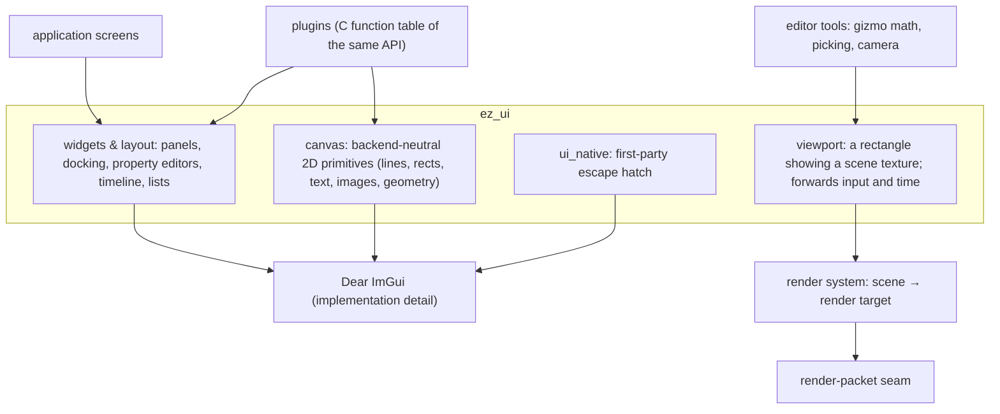

# eZeGo — UI System

> **Status:** Proposal, 2026-10-05. Decisions are *proposed* until confirmed. Decision IDs (`U-n`) are indexed in [`README.md`](./README.md).
> **Companions:** [`windowing.md`](./windowing.md) · [`application-architecture.md`](./application-architecture.md) · [`plugins.md`](./plugins.md) · [`linking.md`](./linking.md) §6 · [`build-system.md`](./build-system.md) B-9
> **Scope:** the boundary between the application (and plugins) and the UI implementation. The widget vocabulary itself is **not** designed here: it waits for the UX designs (U-8).

---

## 1. Decisions

| ID | Decision |
|---|---|
| **U-1** | The application and plugins never call Dear ImGui. All UI goes through the UI system (`ez_ui`). Enforced by the build graph: only `ez_ui` has ImGui's include path (see [`build-system.md`](./build-system.md) B-9). |
| **U-2** | The paradigm for the application and for plugins stays **immediate mode**. This is not a retained-mode framework. |
| **U-3** | The API uses **eZeGo's own vocabulary**, not a one-to-one veneer over ImGui. ImGui's long tail is deliberately cut off; the application uses what the API offers. |
| **U-4** | Three layers with explicit owners: **widgets and layout**, **canvas**, **viewport** (§2). |
| **U-5** | High-level widgets are **expressible as data** (handles and POD, the same keystone as the engine) wherever that is cheap. Immediate mode remains inside: the UI system walks the description each frame. |
| **U-6** | A **viewport is a render target**, not a widget. Scene rendering, lighting preview and gizmo logic live in the render and editor-tool systems behind the render-packet seam. |
| **U-7** | A first-party escape hatch (`ui_native`, name and shape to be revisited) gives direct ImGui access for experiments. Never available to plugins, never allowed in stabilized screens. |
| **U-8** | The widget vocabulary is designed **after** the UX designs exist. What is fixed now: the layers, the rules, the canvas, and the plugin boundary. |

**Why.** One API for the application and for plugins gives systemic control: consistency, theming, keybinding and focus handled in one place, and a stable surface plugins can be versioned against. It also keeps two swaps possible: the graphics backend under ImGui (cheap, ImGui already supports it) and replacing ImGui itself (expensive, but only possible at all because of U-1 and U-3).

**What this costs.** A layer to maintain. Replacing ImGui outright stays expensive even with the wrapper; the certain wins are plugin access, consistency, testability and the viewport split. The swap is an option preserved, not a cheap one.

---

## 2. The three layers

| Layer | What it is | Built from | Who may call it |
|---|---|---|---|
| **Widgets & layout** | The high-level surface: panels, docking, property editors, timeline, cue lists, node graph, fixture pickers. Stable, versioned. | ImGui today | Application, plugins |
| **Canvas** | Low-level 2D drawing in eZeGo's own primitives. What custom widgets (curve editor, node graph, meters) are built from, and how plugins draw custom content without touching ImGui. | ImGui draw lists today | Application, plugins |
| **Viewport** | Shows a scene (2D or 3D stage, visualization). The renderer draws the scene into a texture; the UI composites the image and forwards input. Gizmo **math** (picking, dragging in 3D) belongs to editor tools; gizmo **drawing** uses the canvas. | Render system | Application; plugins receive it as a widget |

This is where "high-level API, low-level implementation" lands: `viewport(scene, camera, preview_lighting)` is one call, and the shaders, shadows and fidelity trade-offs live in the render system, behind the seam that already exists for the renderer swap.

---

## 3. Rules

- **Zero-overhead for first-party code.** The C++ API is inline over the implementation; the C function table exists only at the plugin boundary. Identifiers are handles or hashed IDs, not strings, wherever a widget is per-frame.
- **Plugin UI calls are coarse.** A plugin is asked once per frame to draw its panel; inside, it may issue many widget calls through the table. That is an indirect call per widget, not a hot inner loop, and it stays within the plugin-boundary rule of philosophy §2.8.
- **Main thread only.** Every UI call happens on the display thread. Viewport GPU work goes through the render-packet seam like any other rendering.
- **Data-describable where cheap (U-5).** A panel whose structure can be stated as data gets themes and layouts as files, plugin panels declared rather than drawn, and automated UI tests. This is a property of the high-level API, not a second framework.
- **The escape hatch is visible.** `ui_native` use is grep-able and reviewed; a screen cannot be called stable while it uses it.
- **The window side is specified in [`windowing.md`](./windowing.md).** The chrome (W-2), one ImGui context per native window with multi-viewport off (W-6), the docking and overlay rules (W-7, W-8) and layout persistence (W-9) live there. This module reaches the window through POD events (W-4) and the GPU through a POD draw packet (W-5); it never includes SDL or OpenGL.

---

## 4. Open questions

- **Name and shape of the escape hatch** (`ui_native` is a placeholder): a separate target, a namespace, or a compile-time flag.
- **Widget vocabulary**: waits for the UX designs (U-8).
- **Canvas data format**: whether canvas commands are recorded as POD command lists (which would make them testable and replayable) or issued as direct calls.
- **Viewport interaction model**: how input, picking and gizmo state flow between the UI, editor tools and the engine.
- **UI test harness**: what "automated UI test" means once U-5 exists; UI testing is manual until then.
